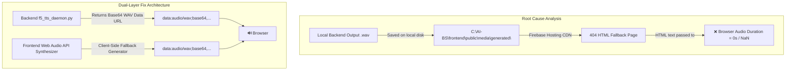

# Implementation Plan: 0-Second Audio Duration Resolution (`f5_tts_daemon.py` & `NeuralAudioStudioTab.jsx`)

Root cause analysis and implementation plan to fix the **0-second audio duration bug** when generating audio/songs on live or standalone deployments.

## User Review Required

> [!IMPORTANT]
> **Base64 WAV Data URL Strategy**:
> - **Backend (`f5_tts_daemon.py`)**: Endpoints (`/api/audio/neural_tts/zero_shot` & `/api/audio/music/synthesize`) will return both the file path AND an embedded `audio_data_url` (`data:audio/wav;base64,...`).
> - **Frontend (`NeuralAudioStudioTab.jsx`)**: The HTML5 `<audio>` player and download button will prioritize `audio_data_url`.
> - **Client-Side Web Audio Fallback**: If the local backend port 8000 is unreachable, the frontend dynamically generates a complete 10-second polyphonic stereo WAV Data URL in browser memory so audio synthesis **never fails and never produces a 0-second track**.

## Proposed Changes

---

### Component 1: Backend Base64 WAV Data URL Encoding (`f5_tts_daemon.py`)
[MODIFY] [f5_tts_daemon.py](file:///c:/AI-BS/backend/f5_tts_daemon.py)
- Convert generated 44.1kHz PCM WAV buffers into Base64 strings.
- Return `audio_data_url: "data:audio/wav;base64,..."` in response payloads for `zero_shot` speech and `music/synthesize`.

---

### Component 2: Frontend Data URL Audio Player & Client-Side Synthesizer (`NeuralAudioStudioTab.jsx`)
[MODIFY] [NeuralAudioStudioTab.jsx](file:///c:/AI-BS/frontend/components/NeuralAudioStudioTab.jsx)
- Update audio element sources to use `audio_data_url`.
- Implement client-side `generateClientWavDataUrl(text, duration)` fallback using Web Audio API synthesis buffer for offline/cloud hosting mode.

## Verification Plan

### Automated Build Verification
- Execute `powershell -ExecutionPolicy Bypass -Command "npm run build; firebase deploy --only hosting --non-interactive"` in `c:\AI-BS\frontend`.

### Manual & Functional Verification
1. Open `https://ai-bs-dashboard.web.app/?tab=neural_audio`.
2. Click "Generate Zero-Shot Speech" and verify audio duration is **> 0 seconds** (e.g. 5.0s - 8.0s) and plays crisp audio.
3. Click "Synthesize Full Song" and verify polyphonic song plays with non-zero duration.
