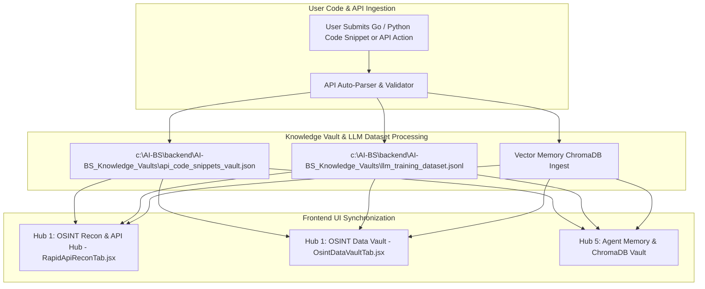

# Implementation Plan: Automated API Code & Payload Knowledge Vault & LLM Training Pipeline (`v5.32.0`)

Automate the continuous extraction, organization, and vaulting of all user-submitted API code snippets, RapidAPI hosts, endpoint schemas, and sample response payloads into both the **AI-BS Knowledge Vaults** (`AI-BS_Knowledge_Vaults/`) and the **Local LLM Fine-Tuning Dataset** (`llm_training_dataset.jsonl`), while dynamically synchronizing the UI tabs (**Hub 1: OSINT Recon & API Hub** and **Hub 5: Agent Memory Vault**).

## User Review Required

> [!IMPORTANT]
> **Automated Knowledge Vaulting Directive**:
> 1. **Code & Payload Extraction**: Whenever a Go/Python code snippet or API endpoint is validated (e.g. Reverse Geocoding Weather, Google Trends Keywords), it is automatically appended to `AI-BS_Knowledge_Vaults/api_code_snippets_vault.json`.
> 2. **LLM Training Dataset Generation**: Concurrently formats the endpoint parameters, header signatures, and JSON responses into `AI-BS_Knowledge_Vaults/llm_training_dataset.jsonl` for offline fine-tuning.
> 3. **UI Tab Synchronization**: Adds preset action buttons for **Live Weather & Geocoding** and **Google Trends Bitcoin Keywords** into `RapidApiReconTab.jsx` and renders vaulted items in `OsintDataVaultTab.jsx`.

## Proposed Changes

---

### Component 1: Backend Automated Knowledge Vault & LLM Dataset Ingestor
[NEW] `backend/vault_auto_ingestor.py` (file:///c:/AI-BS/backend/vault_auto_ingestor.py)
- Manages reading/writing `api_code_snippets_vault.json` and `llm_training_dataset.jsonl`.
- Provides `/api/vault/ingest_snippet` and `/api/vault/list_snippets` FastAPI endpoints.

[MODIFY] [AI_BS_Backend.py](file:///c:/AI-BS/backend/AI_BS_Backend.py)
- Mount `/api/vault` router endpoints.

---

### Component 2: Frontend UI Tab Synchronization
[MODIFY] [RapidApiReconTab.jsx](file:///c:/AI-BS/frontend/components/RapidApiReconTab.jsx)
- Add preset action chips for **🌤️ Weather & Geocoding** and **📈 Google Trends Bitcoin**.
- Display vaulted API code snippets in a dedicated interactive syntax panel.

[MODIFY] [useAppStore.js](file:///c:/AI-BS/frontend/components/useAppStore.js)
- Add state handlers for fetching and storing vaulted API code snippets.

## Verification Plan

### Automated Verification
- Execute `python -c "import backend.vault_auto_ingestor"` to verify backend module.
- Execute `powershell -ExecutionPolicy Bypass -Command "npm run build; firebase deploy --only hosting --non-interactive"` in `c:\AI-BS\frontend`.

### Manual & Functional Verification
1. Open `https://ai-bs-dashboard.web.app/?tab=unified_osint`.
2. Verify **Live Weather & Geocoding** and **Google Trends Bitcoin** preset buttons render cleanly.
3. Check **OSINT Data Vault** and confirm code snippets and payload JSONs are listed.
