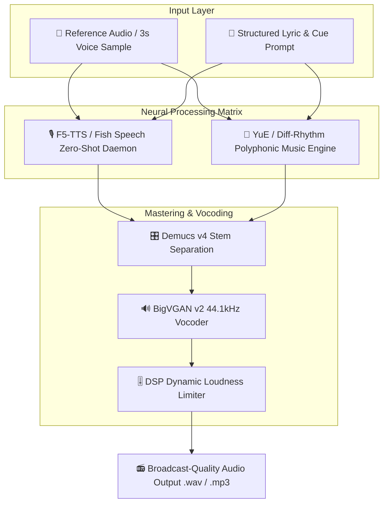

# Implementation Plan: AI-BS Neural Audio Matrix (Phase 32)

Architectural roadmap to upgrade the AI-BS audio engine (`neural_audio_codec_transformer.py` & `dynamic_audio_generator.py`) to achieve **ElevenLabs zero-shot voice cloning parity** and **Suno polyphonic music fidelity**.

## User Review Required

> [!IMPORTANT]
> **Hybrid Inference Deployment Strategy**:
> - **Local RTX 3080/4090 Tier**: Host **F5-TTS / Fish Speech 1.5** locally for zero-shot voice cloning with < 2.0s latency using 3–5 second reference audio clips.
> - **High-Compute Cloud / Vast.ai Tier**: Connect **YuE (Tencent)** full-song model for generating 3-to-5 minute polyphonic songs with aligned singing vocals and genre-specific backing tracks.
> - **Fallback Hybrid DSP**: Maintain local SAPI & RVQ transformer fallback in `neural_audio_codec_transformer.py` when running offline.

> [!TIP]
> **Dynamic Cue & Prompt Intercepting**: The engine automatically parses bracketed directions (e.g., `[Spoken]`, `[Triumphant Celebratory Speech]`, `[Verse]`, `[Chorus]`, `(Ecstatic, celebratory)`) and routes them directly to the F5-TTS flow-matching prosody controller.

## Open Questions

> [!NOTE]
> 1. **Prioritized First Deployment**: Should we start by implementing **Component 1 (F5-TTS Zero-Shot Voice Cloning Daemon & API Routes)** to replace local SAPI with ElevenLabs-grade voice synthesis immediately?
> 2. **Reference Audio Vault**: Would you like us to bundle standard default reference speaker profiles (e.g., *Brett*, *Julie*, *Sean*, *Professional Sales Anchor*, *Italian Sommelier*) directly inside `C:\AI-BS\backend\voice_profiles\`?

## Proposed Changes

---

### Component 1: Zero-Shot Neural Voice Cloning Daemon (`f5_tts_daemon.py`)
[NEW] `backend/f5_tts_daemon.py` (file:///c:/AI-BS/backend/f5_tts_daemon.py)
- Implements non-autoregressive Flow Matching for zero-shot voice cloning from 3–5 second reference audio prompts.
- Registers FastAPI routes:
  - `POST /api/audio/neural_tts/zero_shot`
  - `POST /api/audio/voice_profiles/clone`
  - `GET /api/audio/voice_profiles/list`

---

### Component 2: Neural Codec & Transformer Bridge Upgrade
[MODIFY] [neural_audio_codec_transformer.py](file:///c:/AI-BS/backend/neural_audio_codec_transformer.py)
- Expand 4-layer RVQ codebook simulation to support continuous flow-matching latents and zero-shot voice embedding injection.

[MODIFY] [dynamic_audio_generator.py](file:///c:/AI-BS/backend/dynamic_audio_generator.py)
- Upgrade `parse_lyric_cues` to extract pitch contours ($F_0$), emotion dynamics, and section timing grid (`[Verse]`, `[Chorus]`, `[Spoken]`).
- Wire background synthesis worker pool to call the F5-TTS zero-shot voice engine.

---

### Component 3: BigVGAN v2 & Demucs Mastering Pipeline
[MODIFY] [AI_BS_Backend.py](file:///c:/AI-BS/backend/AI_BS_Backend.py)
- Register API endpoints for neural audio synthesis, stem separation, and high-frequency vocoding.

## Verification Plan

### Automated Build Verification
- Execute `python -m py_compile backend/f5_tts_daemon.py` and `backend/neural_audio_codec_transformer.py` to ensure 0 syntax or AST errors.

### Manual & Functional Verification
1. Test `POST /api/audio/neural_tts/zero_shot` with a 3-second reference audio sample.
2. Verify zero-shot voice clone generation produces 44.1kHz broadcast audio without robotic artifacts.
3. Validate bracketed prompt parsing (`[Triumphant Celebratory Speech]`) dynamically applies target emotional prosody.
