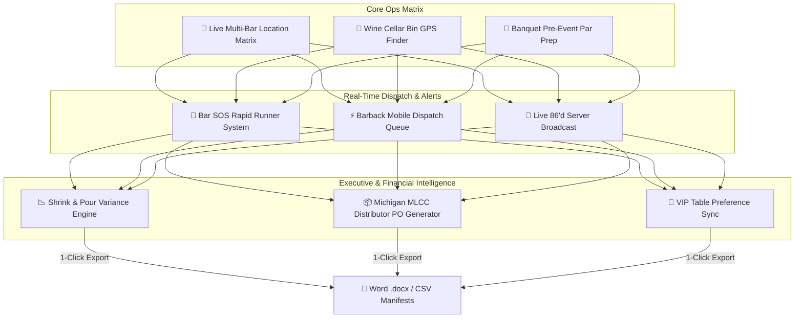

# Implementation Plan: Notō Hospitality Operating Suite (Notō OS v5.28.0)

Comprehensive architectural design for the expanded **Notō Hospitality Suite Ecosystem** (`NotoBarInventoryHub.jsx`), unifying 7 high-impact operational modules for Noto's Old World Italian Dining (Grand Rapids) and Noto's at the Bil-Mar (Grand Haven).

## User Review Required

> [!IMPORTANT]
> **Unified Enterprise Module Architecture**: The **Notō Hospitality Operating Suite** will be built as an expandable hub component (`NotoBarInventoryHub.jsx` & `NotoBarInventoryHub.css`) with 7 dedicated tabs/sub-views:
> 1. **🍸 Multi-Bar Stock & Dispatch**: Real-time 7-zone bottle & keg matrix + barback dispatcher.
> 2. **💒 Banquet Par Prep**: Event guest calculator (Banquet Architect sync) generating pre-event pull manifests.
> 3. **🍷 Wine Cellar Bin GPS**: Physical coordinate finder (Aisle, Rack, Shelf, Bin) with visual vault map.
> 4. **🚨 Bar SOS Rapid Runner**: 1-Tap silent callouts for Ice, Glasses, Lemons/Limes, and CO2 keg blowouts.
> 5. **🔴 Live 86'd Board**: Instant alert interceptor syncing POS terminals, servers, and host stands.
> 6. **📉 Pour Cost & MLCC Shrink**: Variance detection, bottle breakage logger, and audit trail.
> 7. **📦 Distributor PO Generator**: 1-Click order sheets for RNDC, Southern Glazer's, Great Lakes, and Imperial.

> [!TIP]
> **Kiosk & Handheld Dual-Mode**: The application supports 1-thumb operation for mobile phones used by barbacks/servers, as well as high-contrast dark Kiosk Mode for iPad speed rail mounts.

## Open Questions

> [!NOTE]
> 1. **Banquet Integration**: Should the Banquet Par Prep automatically pull guest counts and bar packages directly from active BEO contracts in `NotosEnterpriseOSTab.jsx`?
> 2. **MLCC Distributor Exports**: Would you like distributor purchase orders to generate as formatted Microsoft Word `.docx` documents or standard Excel/CSV order manifests?

## Proposed Changes

---

### Component 1: Noto Hospitality Suite Core Component & Styles
[NEW] `NotoBarInventoryHub.jsx` (file:///c:/AI-BS/frontend/components/NotoBarInventoryHub.jsx)
[NEW] `NotoBarInventoryHub.css` (file:///c:/AI-BS/frontend/components/NotoBarInventoryHub.css)

- **7-Module Nav Deck**: Sub-tabs for Multi-Bar Grid, Banquet Par Prep, Cellar Bin GPS, Bar SOS Runner, Live 86'd Board, Pour Shrink, and MLCC POs.
- **Interactive Multi-Bar Matrix**: Tracks Upstairs Bar, Downstairs Lounge, Banquet Bar A, Banquet Bar B, Patio Bar, Cellar Vault, and Central Storeroom.
- **Barback Mobile Task Drawer**: Accept, En Route, and Stocked workflow with calculated nearest backup stock coordinates.
- **Bar SOS Emergency Panel**: Ice, Glass Racks, Garnishes, and CO2 line swap pings.
- **Visual Wine GPS Finder**: Displays Aisle/Rack/Bin coordinates with visual vault map diagram.
- **MLCC Audit & Breakage Logger**: Photo proof upload and bottle variance tracking.

---

### Component 2: System Navigation, Routing & Access Control
[MODIFY] [navigationConfig.js](file:///c:/AI-BS/frontend/components/navigationConfig.js)
- Register `noto_inventory` ("🍸 Notō Hospitality Operating Suite") under **Hub 3: Noto Hospitality OS**.

[MODIFY] [App.jsx](file:///c:/AI-BS/frontend/App.jsx)
- Register lazy loading: `const NotoBarInventoryHub = safeLazy(() => import('./components/NotoBarInventoryHub.jsx'));`
- Add route mapping for `noto_inventory`.

[MODIFY] [UniversalCommandPalette.jsx](file:///c:/AI-BS/frontend/components/UniversalCommandPalette.jsx)
- Register quick search commands: `"Noto's Bar Inventory", "Dispatch Barback", "Bar SOS", "Cellar Bin GPS", "86'd Board", "MLCC POs"`.

[MODIFY] [NotosEnterpriseOSTab.jsx](file:///c:/AI-BS/frontend/components/NotosEnterpriseOSTab.jsx)
- Add top navigation shortcut bridge linking directly into the new Hospitality Suite.

## Verification Plan

### Automated Build Verification
- Execute `powershell -ExecutionPolicy Bypass -Command "npm run build"` in `c:\AI-BS\frontend` to ensure 0 JSX/Vite bundle compilation errors.

### Manual & Functional Verification
1. **Multi-Bar Matrix Sync**: Verify bottle transfers update inventory counts in real time across all bar zones.
2. **Bar SOS Dispatch Test**: Trigger an Ice or Glass Rack SOS alert and confirm the barback queue receives the audible/haptic ticket.
3. **Wine Cellar Bin GPS Test**: Search for a vintage (e.g., Sassicaia) and confirm exact bin coordinates (Aisle 3, Rack D, Bin 14) are rendered visually.
4. **Distributor PO Generator Test**: Trigger low stock below par levels and verify PO sheet generation.
5. **Firebase Deployment**: Execute `firebase deploy --only hosting --non-interactive` and verify live deployment at `https://ai-bs-dashboard.web.app`.
