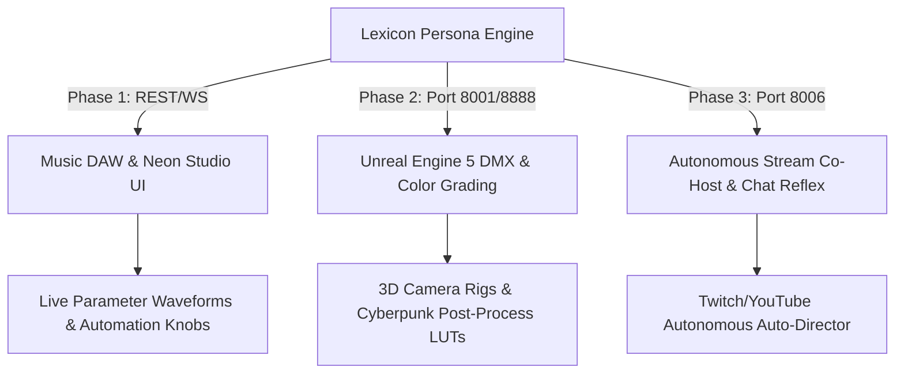

# Theatrical Ecosystem Mega-Expansion: Complete Roadmap

This plan executes all three proposed expansions in a structured, sequential 3-phase roadmap, linking the live Lexicon Persona Engine across Web Audio DAW visualizers, Unreal Engine 5 virtual production environments, and autonomous multi-platform live stream chat reflexes.

---

## Proposed Execution Roadmap

---

## Phase 1: Live DAW & Studio Visualizer Sync (Audio/UI)

### Objectives
- Wire `MusicDAWStudioTab.jsx` and `FuturisticNeonLoungeStudio.jsx` to dynamically subscribe to `http://127.0.0.1:8013/api/vst/theme-state`.
- Render live animated modulation dials and theme badges in the DAW mixer deck.
- Update `dawStore.js` / `omniStore.js` with real-time VST parameter state reflections.

### Modified Files:
- `frontend/src/components/MusicDAWStudioTab.jsx` (or `frontend/components/MusicDAWStudioTab.jsx`)
- `frontend/src/components/FuturisticNeonLoungeStudio.jsx` (or `frontend/components/FuturisticNeonLoungeStudio.jsx`)
- `frontend/components/dawStore.js`

---

## Phase 2: Unreal Engine 5 Theatrical Staging & DMX Lighting (3D/Virtual Production)

### Objectives
- Add a dedicated `/theatrical/stage-trigger` route to `theatrical_gateway.py` (Port 8001) / `aibs_unreal_engine_manager.py`.
- Define procedural Unreal Engine 5 console commands and WebRTC DataChannel payloads for post-process LUT color shifts, DMX spot lighting, and cinematic focal camera cuts.
- Hook `aibs_reasoning_engine.py` to dispatch to Port 8001 on detected themes (*Aggressive*, *Calm*, *Hype*, *Analytical*).

### Modified Files:
- `backend/theatrical_gateway.py`
- `backend/core/unreal_lifecycle_daemon.py` / `backend/aibs_reasoning_engine.py`

---

## Phase 3: Autonomous Stream Co-Host & Chat Sentiment Reflex (Broadcast/Social Automation)

### Objectives
- Connect `aibs_social_daemon.py` (Port 8006) directly to `LexiconService.bulk_expand` and the Reasoning Engine.
- When live stream chat messages arrive from Twitch, YouTube, Kick, or Facebook, the Social Daemon auto-evaluates sentiment through the Lexicon Vault.
- Triggers autonomous persona responses, background VST ducking/automation, and OBS scene cuts without manual broadcast intervention.

### Modified Files:
- `backend/aibs_social_daemon.py`
- `backend/aibs_broadcast_daemon.py`

---

## Verification Plan

### Automated Tests:
- `python -m py_compile` across all backend daemons (`aibs_vst_daemon.py`, `theatrical_gateway.py`, `aibs_social_daemon.py`, `aibs_reasoning_engine.py`).
- Frontend production build check (`npm run build`) and Firebase Hosting deployment (`firebase deploy --only hosting`).

### Manual Verification:
- Trigger `/api/vst/trigger-theme` and confirm real-time parameter dials animate in the React DAW tab.
- Test `/theatrical/stage-trigger` and verify payload receipt on Port 8001.
- Simulate an incoming social chat message in `aibs_social_daemon.py` and observe simultaneous OBS + VST + LLM reaction.

---

## Compliance & Ledger Updates
- Full version bump to `v5.97.0` (Phase 1), `v5.98.0` (Phase 2), and `v5.99.0` (Phase 3).
- Continuous synchronization of `AI_BS_MASTER_ARCHITECTURAL_LEDGER.md`, `AI_BS_MASTER_ECOSYSTEM_MANUAL.md`, and master chronologies.
