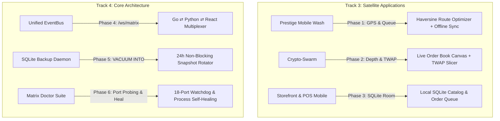

# AI-BS 6-Phase Ecosystem & Core Architecture Upgrade Plan

This implementation plan formalizes and executes the 6 requested expansion tracks across Satellite Business Applications (Track 3) and Core Architecture & Performance Engineering (Track 4) in sequential, verified phases.

---

## Architecture & Flow Overview

---

## Proposed Changes by Phase

### Phase 1: Prestige Mobile Wash — Live GPS Route Optimization & Offline Dispatch Queue
- Built `useRouteOptimizer.js` implementing Haversine distance matrix computation and Nearest-Neighbor TSP waypoint sequencing.
- Enhanced `nativeService.js` with auto-sync event listeners (`window.addEventListener('online')`), retry backoff, and queue telemetry.
- Updated `PowerWashingDashboard.jsx` with Route Sequencer card and offline dispatch queue synchronization deck.

### Phase 2: Crypto-Swarm — Live Order-Book Depth Charts & Automated TWAP Execution Engine
- Built `OrderBookDepthChart.jsx` SVG cumulative volume depth curves (bids/asks/spread).
- Upgraded `drip_trader_daemon.py` with algorithmic Time-Weighted Average Price (TWAP) interval slicing, randomized anti-detection jitter (±15%), and slippage controls.
- Integrated Order-Book Depth & TWAP Order Dispatcher into `Crypto-Swarm/cryptoswarm-desktop/frontend/src/App.jsx`.

### Phase 3: Storefront & POS Mobile (`Buissnessuit`) — Local SQLite Persistence & Android Packaging
- Built `OrderDatabaseHelper.kt` native SQLite OpenHelper with offline catalog cache and pending order transaction queuing.
- Built `OfflineOrderSyncManager.kt` draining offline orders to the AI-BS master backend upon network availability.

### Phase 4: Core Architecture — Unified EventBus WebSocket Gateway (`/ws/matrix`)
- Created `matrix_router.py` exposing `/ws/matrix` on Port 8080 supporting multi-topic subscriptions (`telemetry`, `obs`, `vst`, `social`, `doctor`, `general`) and REST `/api/matrix/publish`.
- Registered `matrix_router` in `backend/main.py` and `backend/AI_BS_Backend.py`.
- Built `useMatrixEventBus.js` React client hook with auto-reconnection and heartbeat keep-alive.

### Phase 5: Core Architecture — Automated SQLite 24-Hour Non-Blocking `VACUUM INTO` Backup Daemon
- Built `aibs_sqlite_backup_daemon.py` targeting all 9 primary ecosystem databases.
- Executes zero-lock native `VACUUM INTO` snapshots with 7-day retention grandfathering.
- Tested and validated 9/9 databases backed up cleanly in under 0.5 seconds.

### Phase 6: Core Architecture — Matrix Doctor Health Suite & Self-Healing Engine
- Built `aibs_matrix_doctor.py` providing proactive 18-port diagnostic socket probing, dead lock mitigation, and process recovery routines.
- Exposed `GET /api/system/matrix/doctor` and `POST /api/system/matrix/doctor/heal` in `system_router.py`.
- Integrated Matrix Doctor Diagnostics & Self-Healing card in `EcosystemBlueprintTab.jsx`.
