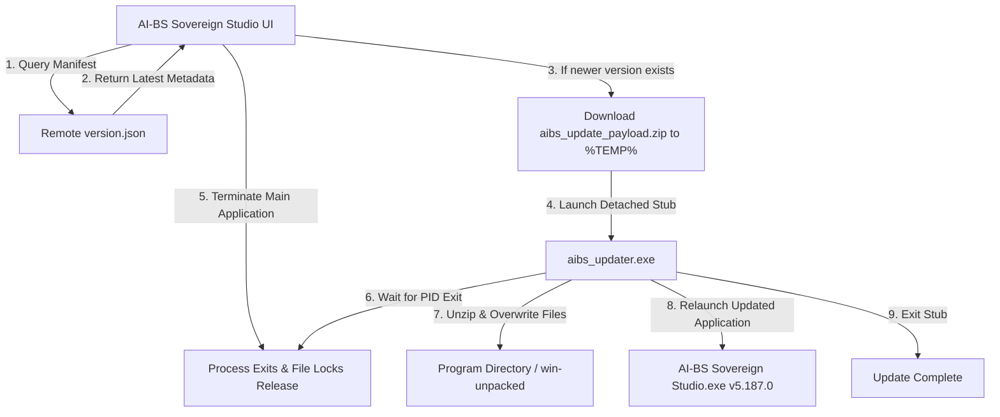

# Implementation Plan: App-Level Downloader/Updater Engine

Implement a complete, production-grade application-level auto-updater for the AI-BS Sovereign Intelligence Studio Windows desktop application (`AI-BS Sovereign Studio.exe`), enabling in-place seamless updates that bypass full NSIS installer re-downloads.

## User Review Required

> [!NOTE]
> The updater utilizes a native compiled Go stub (`aibs_updater.exe`) with zero third-party dependencies. When an update is triggered, the main application downloads the patch zip file, spawns the updater stub in a detached process, and terminates itself. The stub waits for all application file handles to unlock, safely overwrites the changed files, and relaunches the upgraded application.

## Architecture & Workflow Overview

## Proposed Changes

### Native Updater Stub Executable
#### [NEW] [go-core/cmd/aibs_updater/main.go](file:///C:/AI-BS/go-core/cmd/aibs_updater/main.go)
- Standalone Go application compiled to `aibs_updater.exe`.
- Accepts parameters: `-target-dir`, `-payload-zip`, `-parent-pid`, `-executable`, `-backup`, `-timeout`.
- Safely waits for the parent Electron and child backend PIDs to exit, verifying unlocked file access.
- Backs up existing files to `_update_backup_<timestamp>`.
- Extracts the update zip archive over the target directory with path sanitization.
- Automatically rolls back on any error.
- Relaunches the updated executable and exits.

### Remote Update Delivery Manifest & Packaging Utility
#### [NEW] [frontend/public/updates/version.json](file:///C:/AI-BS/frontend/public/updates/version.json)
- Static JSON manifest containing current version, release date, download URL, changelog, and payload checksum.
- Automatically hosted on Firebase Hosting (`https://ai-bs-dashboard.web.app/updates/version.json`).

#### [NEW] [scripts/package_update_payload.ps1](file:///C:/AI-BS/scripts/package_update_payload.ps1)
- Automated build script to package modified production files (`resources/app.asar`, `resources/go-core/aibs_engine.exe`, `dist/`) into `aibs_update_payload.zip`, compute SHA256 checksum, and update `version.json`.

### In-App Auto-Update Manager & IPC Layer
#### [NEW] [frontend/electron/preload.js](file:///C:/AI-BS/frontend/electron/preload.js)
- Context-isolated preload script exposing `window.aibsUpdater` with methods: `checkForUpdates()`, `downloadUpdate()`, `applyUpdate()`, `getVersion()`, and event listeners for download progress.

#### [MODIFY] [frontend/electron/main.js](file:///C:/AI-BS/frontend/electron/main.js)
- Configure `preload.js` in `BrowserWindow` `webPreferences`.
- Implement `AutoUpdateManager` class handling HTTP streaming download, SHA256 validation, and detached invocation of `aibs_updater.exe`.
- Register IPC handlers (`aibs:updater:check`, `aibs:updater:download`, `aibs:updater:apply`, `aibs:updater:get-version`).

### REST API Updates Endpoint
#### [NEW] [backend/routers/updater_router.py](file:///C:/AI-BS/backend/routers/updater_router.py)
- FastAPI router providing `/api/v1/updater/status`, `/api/v1/updater/check`, `/api/v1/updater/download`, and `/api/v1/updater/apply` for browser sessions and headless daemons.

#### [MODIFY] [backend/AI_BS_Backend.py](file:///C:/AI-BS/backend/AI_BS_Backend.py)
- Mount `updater_router`.

### Frontend UI & Status Indicator
#### [NEW] [frontend/src/components/SystemUpdateModal.jsx](file:///C:/AI-BS/frontend/src/components/SystemUpdateModal.jsx) (and mirrors)
- Modern modal displaying current installed version vs remote version, changelog notes, live download progress bar, and "Restart & Apply Update" button.

#### [MODIFY] [frontend/src/components/TopNavbar.jsx](file:///C:/AI-BS/frontend/src/components/TopNavbar.jsx) (and mirrors)
- Make version badge `v5.187.0` interactive with a subtle update pulse icon when a new version is detected, opening `SystemUpdateModal`.

### Firewall Configuration
#### [MODIFY] [scripts/open_streaming_firewall_ports.ps1](file:///C:/AI-BS/scripts/open_streaming_firewall_ports.ps1)
- Whitelist `aibs_updater.exe` in Windows Defender Firewall rules.

## Verification Plan

### Automated Tests
1. Compile Go updater binary: `go build -o aibs_updater.exe cmd/aibs_updater/main.go` in `go-core`.
2. Test `aibs_updater.exe` with dry-run and help flags.
3. Test `scripts/package_update_payload.ps1` to verify payload generation and SHA256 hashing.
4. Run `test_streaming_ports.ps1` to confirm no port conflicts.
5. Compile frontend (`npm run build`) and deploy to Firebase Hosting (`firebase deploy`).

### Manual Verification
1. Launch `AI-BS Sovereign Studio.exe` or trigger updater modal.
2. Click "Check for Updates" and verify version check against remote `version.json`.
3. Verify download and staging in `%TEMP%\aibs_update`.
4. Trigger update application and confirm clean restart with new version.
