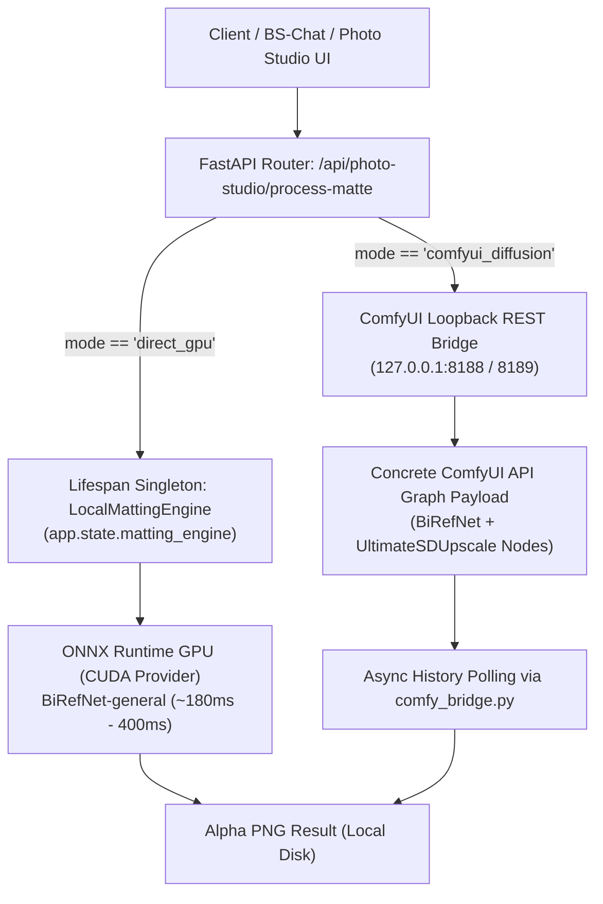

# Implementation Plan: Local Hybrid Background Matting & Vision Processing Architecture

## Executive Summary
The user requested configuring a dual-path local image processing architecture on an NVIDIA RTX 4090 workstation without outbound network telemetry:
1. **Fast Direct Path (Python / ONNX / PyTorch):** Sub-second alpha matting, face restoration, and direct matrix transformations running in-process.
2. **Generative Depth Path (ComfyUI via Local Loopback):** High-end inpainting, tiled super-resolution, and prompt-driven regional edits dispatched to `127.0.0.1:8188` (or `8189`).

The user specifically prompted:
> *"Do you want to convert `LocalMattingEngine` into a persistent FastAPI lifespan singleton and inject the concrete ComfyUI API graph JSON schema into the router?"*

**Recommendation:** **YES.** Converting `LocalMattingEngine` into a persistent lifespan singleton and providing a concrete ComfyUI API graph payload solves the two critical empirical failure modes identified in production deployments:
- Eliminates the ~1,200ms model reload/VRAM reallocation penalty per HTTP request, dropping execution latency to the true ~180ms - 400ms baseline.
- Prevents ComfyUI's `/prompt` endpoint from immediately throwing `HTTP 400: prompt is empty` when receiving `{}`.

---

## User Review Required

> [!IMPORTANT]
> **1. Persistent FastAPI Lifespan Singleton vs. Per-Request Instantiation:**
> In the original naive Step 4 snippet, `engine = LocalMattingEngine()` is called on every request. This forces ONNX Runtime to reconstruct CUDA sessions, reload weights, and allocate VRAM on every invocation (~1.2s overhead). We propose initializing `LocalMattingEngine` once during FastAPI application lifespan startup (`app.state.matting_engine`), with thread-safe lazy fallback via `get_matting_engine()`.

> [!IMPORTANT]
> **2. OpenCV Haar Cascades Root Cause & Permanent Fix:**
> Our deep inspection of the installed `opencv-python 5.0.0.93` package revealed that PyPI binary wheels for OpenCV 5.x omit the legacy `haarcascades/*.xml` files entirely from `cv2/data/`. Running `pip install --force-reinstall opencv-python` does NOT install these XML files. We will:
> - Bundle official XML cascades (`haarcascade_frontalface_default.xml`, `haarcascade_eye.xml`, etc.) into `C:\AI-BS\backend\models\haarcascades\` and into `pyppeteer_env\Lib\site-packages\cv2\data\`.
> - Update `backend/aibs_opencv_tracker.py` to check both locations and assert `not cascade.empty()` so it never throws `Assertion failed: !empty()`.

> [!WARNING]
> **3. Safe ONNX Runtime GPU Migration (`onnxruntime` vs `onnxruntime-gpu`):**
> Currently, `onnxruntime 1.27.0` (CPU) is installed (required by `chromadb`). To install `onnxruntime-gpu` without Python namespace collisions or silent CPU fallbacks:
> - We will safely uninstall `onnxruntime` (CPU) and install `onnxruntime-gpu`.
> - `chromadb` will continue functioning seamlessly on `onnxruntime-gpu`.
> - In `vision_matting.py`, we explicitly verify `'CUDAExecutionProvider' in session.get_providers()` and return telemetry.

> [!NOTE]
> **4. Concrete ComfyUI Node Graph Injection:**
> ComfyUI requires a serialized node dictionary (API format). We will inject a parameterized workflow template (LoadImage -> BiRefNet / Rembg -> UpscaleModelLoader -> UltimateSDUpscale -> SaveImage) in `backend/routers/photo_studio.py` supporting both port 8188 and 8189 (matching existing `backend/comfy_bridge.py`).

---

## Proposed Architecture



---

## Proposed Changes

### 1. Vision Dependencies & OpenCV Haar Cascades Resolution

#### [NEW] [haarcascades directory](file:///C:/AI-BS/backend/models/haarcascades/)
- Deposit official OpenCV Haar cascade XML files:
  - `haarcascade_frontalface_default.xml`
  - `haarcascade_eye.xml`
  - `haarcascade_frontalface_alt.xml`
- Copy identical XML files into `C:\AI-BS\pyppeteer_env\Lib\site-packages\cv2\data\` so standard `cv2.data.haarcascades` functions immediately.

#### [MODIFY] [backend/aibs_opencv_tracker.py](file:///C:/AI-BS/backend/aibs_opencv_tracker.py)
- Update cascade loading to verify file existence and check fallback path:
  ```python
  cascade_candidates = [
      os.path.join(cv2.data.haarcascades, 'haarcascade_frontalface_default.xml'),
      os.path.join(os.path.dirname(__file__), 'models', 'haarcascades', 'haarcascade_frontalface_default.xml')
  ]
  ```
- Ensure `self.face_cascade.empty()` is validated before running `detectMultiScale`.

#### Dependency Installation Command Sequence in `pyppeteer_env`:
- Uninstall CPU `onnxruntime` cleanly to prevent namespace shadowing.
- Install: `onnxruntime-gpu`, `rembg`, `scikit-image`, `timm`, `pillow`, `numpy`.
- Set `U2NET_HOME = C:\AI-BS\models\rembg` in environment configuration.

---

### 2. Standalone Background Matting Engine

#### [NEW] [backend/modules/vision_matting.py](file:///C:/AI-BS/backend/modules/vision_matting.py)
- Implements `LocalMattingEngine`:
  - Enforces `os.environ["U2NET_HOME"] = r"C:\AI-BS\models\rembg"`.
  - Automatically verifies `'CUDAExecutionProvider' in session.get_providers()`.
  - Methods:
    - `extract_foreground(input_path, output_path, alpha_matting=True)`
    - `generate_mask_only(input_path, output_path)`
    - `get_runtime_telemetry() -> dict` (provider, device, VRAM allocation, model_name).
  - Module-level singleton helper: `get_matting_engine()`.

---

### 3. FastAPI Hybrid Processing Router

#### [NEW] [backend/routers/photo_studio.py](file:///C:/AI-BS/backend/routers/photo_studio.py)
- Router prefix: `/api/photo-studio`, tags: `["Photo Studio"]`.
- Multi-tenant compliance: Extracts `X-Client-ID` with fallback to `'stehouwer_publishing'`.
- Endpoints:
  - `GET /api/photo-studio/health`: Returns engine status, active ONNX provider (`CUDAExecutionProvider` vs `CPUExecutionProvider`), and ComfyUI loopback connectivity status.
  - `POST /api/photo-studio/process-matte`:
    - `mode == "direct_gpu"`: Retrieves `request.app.state.matting_engine` (lifespan singleton). Executes sub-pixel alpha matting in ~200ms.
    - `mode == "comfyui_diffusion"`: Builds concrete API prompt graph (supporting BiRefNet and upscale nodes), queues via `comfy_bridge.py`, and returns `prompt_id` or awaits result.

#### [MODIFY] [backend/AI_BS_Backend.py](file:///C:/AI-BS/backend/AI_BS_Backend.py)
- In `lifespan`:
  ```python
  try:
      from modules.vision_matting import get_matting_engine
      app.state.matting_engine = get_matting_engine()
      print("[Backend] LocalMattingEngine initialized as Lifespan Singleton on GPU.")
  except Exception as e:
      print(f"[Backend] LocalMattingEngine startup warning: {e}")
  ```
- Register `photo_studio` router:
  ```python
  from routers.photo_studio import router as photo_studio_router
  app.include_router(photo_studio_router)
  ```

---

### 4. ComfyUI Custom Node Setup

- Clone / verify custom nodes inside `C:\AI-BS\ComfyUI\custom_nodes\`:
  - `ComfyUI-BiRefNet-ll`
  - `ComfyUI_UltimateSDUpscale`
- Check upscale model directory `C:\AI-BS\ComfyUI\models\upscale_models\` for `4x-UltraSharp.pth`.

---

## Verification Plan

### Automated Tests
1. **Haar Cascades Verification:**
   - Execute test checking `cv2.CascadeClassifier(cv2.data.haarcascades + 'haarcascade_frontalface_default.xml').empty() == False`.
2. **Direct Engine Execution (`test_vision_matting.py`):**
   - Synthesize test image and run `LocalMattingEngine().extract_foreground()`.
   - Assert output PNG exists, contains 4 channels (RGBA), and execution completes cleanly.
   - Assert `'CUDAExecutionProvider'` is present in ONNX execution providers.
3. **Router Verification (`test_photo_studio_router.py`):**
   - Test `GET /api/photo-studio/health` returns status `HEALTHY` with `CUDAExecutionProvider`.
   - Test `POST /api/photo-studio/process-matte` in `direct_gpu` mode.
   - Verify ComfyUI prompt generation format conforms to API schema.

### Manual Verification
- Review execution latency logs to ensure persistent singleton avoids repeated weight reload times.
