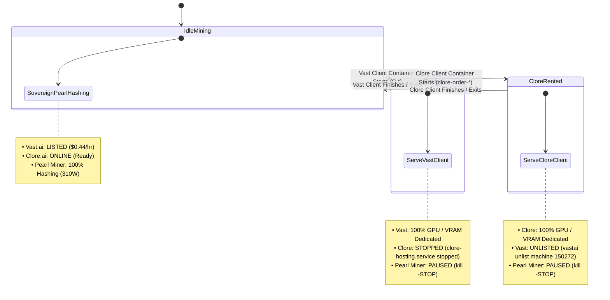

# Implementation Plan: Tri-Yield Compute Concurrency Engine (Vast.ai, Clore.ai & Sovereign Pearl Mining)

## User Review Required

> [!IMPORTANT]
> The single NVIDIA GeForce RTX 4090 (24GB VRAM) and AMD Ryzen 9 9950X (24 vCPUs) cannot run two paid customer rental containers simultaneously without risking severe VRAM out-of-memory crashes, driver resets, and client rental penalties. 
> To maximize operator revenue while keeping both marketplaces active, this plan establishes a **Tri-Yield Mutual Exclusion Watchdog** that keeps both Vast.ai and Clore.ai open for orders, grants 100% hardware dedication to whichever platform gets rented first, pauses the competing platform to prevent double-booking, and mines sovereign Pearl PoUW during all idle gaps.

---

## 1. Current Architectural Baseline

| Component | Host Environment | Daemon / Process | Detection Mechanism |
| :--- | :--- | :--- | :--- |
| **Vast.ai Marketplace** | WSL2 `Ubuntu-24.04` | `vastai.service` (`kaalia`) | Docker containers matching `C.*` |
| **Clore.ai Marketplace** | WSL2 `Ubuntu` | `clore-hosting.service` | Docker containers matching `clore-order-*` |
| **Sovereign Pearl Mining** | WSL2 `Ubuntu` | `/opt/peakminer/peakminer` | Linux PID via `pgrep -f peakminer` |
| **Host Memory (DDR5)** | Windows 11 Host | `vmmemWSL` (52GB max limit) | Reclaimable via Linux drop_caches |

---

## 2. Tri-Yield State Machine & Mutual Exclusion Matrix

### Detailed Transition Rules

1. **State 0: Idle Pool (Both Listening, Pearl Hashing)**
   - **Vast.ai:** Listed on marketplace (`listed: true`, Offer ID `50283451`).
   - **Clore.ai:** Online and waiting (`clore-hosting.service` active).
   - **Pearl Mining:** Active and hashing at ~125–165 TH/s (`kill -CONT <pid>`).
   - **Hardware Impact:** 310W power cap, 5001 MHz memory lock, 47–50°C core thermals.

2. **State 1: Vast.ai Rental Active**
   - **Trigger:** Docker container starting with `C.` detected in `Ubuntu-24.04`.
   - **Action 1 (Miner):** Send `kill -STOP` to `peakminer` in `Ubuntu`. VRAM is freed instantly without dropping stratum connection.
   - **Action 2 (Clore):** Execute `systemctl stop clore-hosting.service` in `Ubuntu`. Clore marks machine unavailable on marketplace, preventing a Clore client from booking the same GPU.
   - **Resolution:** When Vast container is destroyed, watchdog restarts Clore (`systemctl start clore-hosting.service`) and resumes Pearl miner (`kill -CONT <pid>`).

3. **State 2: Clore.ai Rental Active**
   - **Trigger:** Docker container starting with `clore-order-` detected in `Ubuntu`.
   - **Action 1 (Miner):** Send `kill -STOP` to `peakminer` in `Ubuntu`.
   - **Action 2 (Vast):** Execute `vastai unlist machine 150272` in `Ubuntu-24.04`. Vast hides the offer from search results so no Vast client can book the GPU while Clore is running.
   - **Resolution:** When Clore rental container terminates, watchdog relists Vast (`vastai list machine 150272 -p 0.44 -b 0.34 -s 0.10 -d 0.01 -u 0.01 -l '30 days'`) and resumes Pearl miner (`kill -CONT <pid>`).

---

## 3. Host Memory & Cache Optimization (Resolving 51.1 GB Usage)

As observed in Windows Task Manager, memory usage reached 51.1 GB in use because WSL2's virtual machine allocation (`memory=52GB` in `.wslconfig`) holds Linux disk cache in `buff/cache` (16.3 GB).
- **Integration:** The updated watchdog daemon will execute a periodic non-disruptive cache trim (`sync; echo 3 > /proc/sys/vm/drop_caches`) every 5 minutes inside WSL2.
- **Result:** Linux page caches are dropped, Hyper-V (`VmmemWSL`) immediately releases committed physical RAM back to Windows, and Windows host available memory increases by 10–15 GB.

---

## 4. Proposed Changes

### Watchdog Daemon & Launchers

#### [MODIFY] [vast_pearl_concurrency_watchdog.py](file:///C:/AI-BS/miners/vast_pearl_concurrency_watchdog.py)
- Expand detection to monitor both `Ubuntu-24.04` (Vast) and `Ubuntu` (Clore).
- Implement two-way mutual exclusion:
  - If Vast active -> Pause Pearl miner + Stop Clore service.
  - If Clore active -> Pause Pearl miner + Unlist Vast machine.
  - If both idle -> Restore both listings + Resume Pearl miner.
- Add background memory cache trimmer executing every 300 seconds.

#### [MODIFY] [Launch_AI_BS.bat](file:///C:/AI-BS/Launch_AI_BS.bat)
- Ensure the updated watchdog daemon starts seamlessly on system boot.

---

## 5. Verification Plan

### Automated Verification
1. **Clore Service Control Test:** Verify `systemctl stop clore-hosting.service` and `systemctl start clore-hosting.service` execute cleanly from Python interop.
2. **Vast Listing Control Test:** Verify `vastai unlist machine 150272` and `vastai list machine 150272 ...` execute cleanly.
3. **Memory Trimming Test:** Verify running cache drop reclaims host RAM in Windows Task Manager.
4. **Watchdog Dry Run:** Run watchdog in live monitor mode and verify state transitions in `miners/logs/concurrency_watchdog.log`.

### Manual Operator Verification
- Confirm that both Vast.ai and Clore.ai console pages show the machine as available when idle.
- Verify in Windows Task Manager that memory usage stabilizes with plenty of available headroom.
