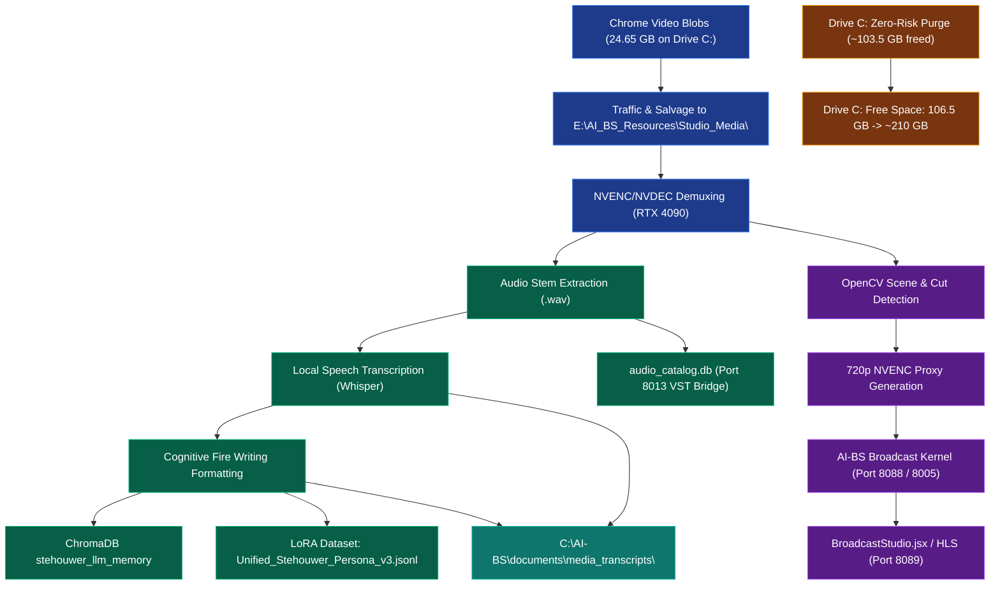

# Architecture: AI-BS Multimodal Media Pipeline, Stehouwer Audio Learning Engine & Drive C: Storage Optimization

## Overview & Executive Rationale

This plan fulfills two objectives simultaneously:
1. **Salvage & Monetize Unused Data Assets for Stehouwer LLM & AI-BS**:
   - Rescues the **24.65 GB of raw MP4 video captures** currently trapped in Chrome's temporary IndexedDB cache (`streamlabs.com` and `visla.us`).
   - Traffics these media files to high-capacity storage (**`E:\AI_BS_Resources\Studio_Media\`**, which currently has **254.35 GB free**).
   - Deploys an automated **Stehouwer Audio & Video Learning Pipeline**:
     - Demuxes pristine 16-bit 16kHz audio stems using hardware-accelerated `ffmpeg` (NVDEC on RTX 4090).
     - Generates timestamped speech-to-text cognitive transcripts using local Whisper.
     - Formats and ingests transcripts directly into **`stehouwer_llm_memory`** (ChromaDB) and **`Unified_Stehouwer_Persona_v3.jsonl`** (for LoRA / Unsloth fine-tuning).
     - Catalogs musical/spectral features into `database\audio_catalog.db` for the VST Bridge (Port 8013) and Sovereign Studio DAW.
     - Adds automated scene detection, thumbnail contact sheets, and NVENC proxy generation for the **AI-BS Broadcast Engine** (Port 8005) and **Broadcast Kernel** (Port 8088).
2. **Reclaim Maximum Drive C: Disk Space (~103.5 GB direct + ~20–40 GB WSL compaction)**:
   - Purges confirmed zero-utility diagnostic dumps, developer caches, temporary buffers, and Windows hibernation, raising free space on Drive C: from **106.5 GB to ~210+ GB**.
3. **Organized Document Storage Mandate**:
   - In accordance with the user directive, **all documentation, transcripts, extraction manifests, technical ledgers, and plans are stored in organized root directories inside `C:\AI-BS`**.



---

## AI-BS Root Organized Document Architecture

All generated documents, artifacts, and knowledge records will be strictly maintained under `C:\AI-BS\` in the following structured hierarchy:

```
C:\AI-BS\
├── documents\
│   ├── media_transcripts\       <-- Formatted Markdown speech-to-text transcripts, cognitive Fire Writing blocks, VTT subtitles
│   ├── technical_manuals\       <-- Versioned system manuals and architectural ledgers
│   ├── studio_manifests\        <-- Extracted media catalogs, video/audio metadata manifests, codec profiles
│   └── operational_plans\       <-- User proposals, feature evaluations, and system plans
├── Agent_Implementation_Plans_History\  <-- Permanent chronological implementation plans
├── Agent_Tasks_History\                 <-- Permanent chronological task lists
├── database\                            <-- SQLite databases, LoRA datasets (Unified_Stehouwer_Persona_v3.jsonl)
└── saved_data\artifacts\                <-- Date-stamped manual backups (YYYYMMDD_*)
```

---

## User Review Required

> [!IMPORTANT]
> In accordance with the **Strict Prohibition of Auto-Proceed on Plans & Proposals**, execution is halted until you provide explicit manual confirmation in chat.

Please review the proposed execution sequence:
- **Phase A (Media Extraction & Offload to Drive E:)**: Copy the 3 large Streamlabs MP4 recordings and Visla blobs to `E:\AI_BS_Resources\Studio_Media\Raw_Captures\`. Verify file integrity and hashes before touching Chrome cache.
- **Phase B (Zero-Risk System Purge on Drive C:)**: Purge LiveKernel dump (16.35 GB), Hibernation `powercfg /h off` (26.48 GB), DXCache (11.97 GB), Pip/NPM caches (11.35 GB), Temp files (6.79 GB), DevTools MCP backups (5.14 GB), Recycle Bin (0.80 GB), and clear the freed Chrome IndexedDB blob directory (24.65 GB). Net space reclaimed on Drive C: **~103.5 GB**.
- **Phase C (Stehouwer Multimodal Media Engine Deployment)**: Deploy `backend/aibs_media_processor.py` for automated demuxing, scene detection, transcription, and vector memory ingestion. Output all transcripts into `C:\AI-BS\documents\media_transcripts\`.
- **Phase D (WSL2 VHDX Compaction)**: Compact Ubuntu and Ubuntu-24.04 virtual disks to release unallocated space back to Windows.

---

## Open Questions

1. **Transcription Persona Attribution:**
   - Are the Streamlabs recordings primarily spoken discussions by you (Brett)? Should all transcripts be categorized under persona `brett_stehouwer` in `C:\AI-BS\database\Unified_Stehouwer_Persona_v3.jsonl`?
2. **Drive Storage for High-Capacity Video:**
   - We will store the high-bitrate raw video files (24.65 GB) on `E:\AI_BS_Resources\Studio_Media\` (254 GB free) and place all generated text transcripts, manifests, and documentation directly in `C:\AI-BS\documents\`. Please confirm this split.

---

## Proposed Changes

### Media Pipeline & Audio Learning Components

#### [NEW] [backend/aibs_media_processor.py](file:///C:/AI-BS/backend/aibs_media_processor.py)
- High-throughput Python CLI and FastAPI router mounted on Port 8088 (`AI-BS Broadcast Kernel`).
- Implements:
  - `extract_audio_stems()`: Uses hardware `ffmpeg` with NVDEC to extract clean 16kHz mono WAV files for LLM ingestion.
  - `transcribe_media()`: Runs local Whisper on the RTX 4090 to generate timestamped text, JSON, and VTT subtitle tracks, saving directly into `C:\AI-BS\documents\media_transcripts\`.
  - `ingest_to_stehouwer_memory()`: Formats transcribed text into Stehouwer cognitive blocks and appends to:
    - ChromaDB collection `stehouwer_llm_memory` (Port 8002).
    - `C:\AI-BS\database\Unified_Stehouwer_Persona_v3.jsonl`.
    - SQLite table in `E:\AI_BS_Resources\Databases\video_broadcast.db`.
  - `generate_video_proxies()`: Generates ultra-fast 720p streaming proxies via `av1_nvenc` or `h264_nvenc` for smooth scrubbing in `BroadcastStudio.jsx`.
  - `detect_scenes()`: Uses OpenCV frame differencing to identify scene changes and extract thumbnail contact sheets into `C:\AI-BS\documents\studio_manifests\`.

#### [MODIFY] [backend/aibs_broadcast_kernel.py](file:///C:/AI-BS/backend/aibs_broadcast_kernel.py)
- Import and register the new Media Studio router (`/api/media/...`):
  - `GET /api/media/catalog`: List all processed studio videos, proxies, and transcripts from `C:\AI-BS\documents\`.
  - `POST /api/media/process`: Trigger background extraction, transcription, and proxy generation.
  - `GET /api/media/stream/{video_id}`: Stream media directly or through HLS/RTMP pipeline.

#### [MODIFY] [frontend/src/components/BroadcastStudio.jsx](file:///C:/AI-BS/frontend/src/components/BroadcastStudio.jsx)
- Add a **"Studio Media Vault"** panel showing salvaged video assets with one-click transcript review, scene thumbnail scrubbing, and broadcast cueing.

---

## System Disk Purge Execution Steps (Drive C:)

1. **Delete Orphaned LiveKernel Crash Dump:**
   - Path: `C:\Windows\LiveKernelReports\NetAdapterCx-20260718-1837.dmp` (**16.35 GB**)
2. **Disable Windows Hibernation on Desktop:**
   - Command: `powercfg /h off` (**26.48 GB**)
3. **Purge NVIDIA DirectX Shader Cache:**
   - Path: `C:\Users\footb\AppData\Local\NVIDIA\DXCache` (**11.97 GB**)
4. **Purge Development Package Caches:**
   - `pip cache purge` (**7.48 GB**)
   - `npm cache clean --force` (**3.87 GB**)
5. **Clean Temporary Folders:**
   - `C:\Users\footb\AppData\Local\Temp` & `C:\Windows\Temp` (**6.79 GB**)
6. **Purge Chrome DevTools MCP Backups:**
   - `C:\Users\footb\.cache\chrome-devtools-mcp` (**5.14 GB**)
7. **Empty Windows Recycle Bin:**
   - `Clear-RecycleBin -DriveLetter C -Force` (**0.80 GB**)
8. **Clear Freed Chrome Streamlabs / Visla IndexedDB Blobs:**
   - Only executed *after* Phase A verifies all media is safely copied to Drive E: (**24.65 GB**)
9. **WSL2 VHDX Disk Compaction:**
   - `wsl --manage Ubuntu --compact`
   - `wsl --manage Ubuntu-24.04 --compact` (**~20–40 GB**)

---

## Verification Plan

### Automated Verification
1. **Drive Space Measurement:**
   - Run `Get-PSDrive C, E` to verify Drive C: free space expands from 106.5 GB to **~210+ GB**, and Drive E: securely holds the salvaged media.
2. **Media Extraction & Integrity Probe:**
   - Verify all 3 MP4 video files have non-zero sizes, valid MP4 headers (`ftypisom`), and playable audio streams via `ffprobe`.
3. **Transcription & Ingestion Test:**
   - Run a test extraction on the first 60 seconds of video audio.
   - Verify speech is transcribed, written to `C:\AI-BS\documents\media_transcripts\`, passed to `stehouwer_llm_memory`, and queryable via ChromaDB on Port 8002.
4. **Protected Path Audit:**
   - Verify `C:\AI-BS` codebase, `C:\Users\footb\.cache\huggingface` models, Steam Call of Duty, and Epic Games remain 100% intact.
