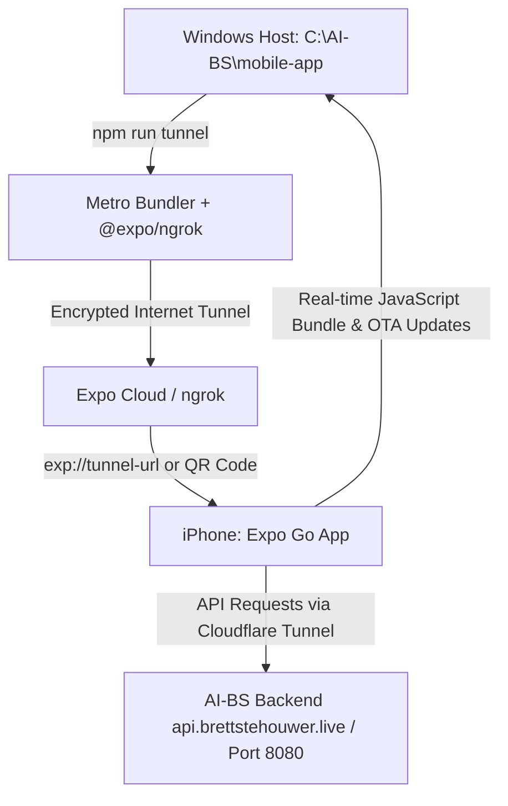

# Implementation Plan: React Native + Expo Mobile App (`mobile-app/`) with iPhone Tunnel Sharing

Set up, configure, and verify a cross-platform React Native + Expo application in `C:\AI-BS\mobile-app` with TypeScript, tunneling support (`@expo/ngrok`), safe-area UI components, and connection to the AI-BS central cognitive engine for real-time testing on iPhone via Expo Go.

## User Review Required

> [!IMPORTANT]
> This setup provisions a native React Native + Expo project in `C:\AI-BS\mobile-app`.
> Your friend or Anna Joy can install the free **Expo Go** app from the iOS App Store, scan your terminal's QR code (or click the tunnel link), and immediately run the native app on their iPhone without requiring an Apple Developer account, Mac hardware, or local Wi-Fi pairing.

## Proposed Architecture & Workflow

---

## Proposed Changes

### Mobile Project Initialization (`C:\AI-BS\mobile-app`)

#### [NEW] [mobile-app/package.json](file:///C:/AI-BS/mobile-app/package.json)
- Initialize Expo project with React Native, TypeScript, and Expo Router or blank-typescript template.
- Install `@expo/ngrok` as a development dependency.
- Define scripts:
  - `"start"`: `expo start`
  - `"tunnel"`: `expo start --tunnel`
  - `"android"`: `expo start --android`
  - `"ios"`: `expo start --ios`
  - `"web"`: `expo start --web`

#### [NEW] [mobile-app/app.json](file:///C:/AI-BS/mobile-app/app.json)
- Configure app name: `"AI-BS Mobile"`, slug: `"ai-bs-mobile"`, version: `"5.236.0"`, orientation: `"portrait"`.
- Configure iOS dynamic island / safe area boundaries and custom icon/splash configuration.

#### [NEW] [mobile-app/App.tsx](file:///C:/AI-BS/mobile-app/App.tsx)
- Cross-platform styled interface with `react-native-safe-area-context`.
- Displays real-time AI-BS system status, active version badge (`v5.236.0`), and connection to `https://api.brettstehouwer.live`.
- Native mobile chat interface for direct communication with Stehouwer LLM from iPhone.

#### [NEW] [mobile-app/README.md](file:///C:/AI-BS/mobile-app/README.md)
- Complete step-by-step operating instructions for launching tunnels, testing in browser/Android, and sharing with iPhone users.

---

## Verification Plan

### Automated Verification
- Run `npx expo-doctor` inside `C:\AI-BS\mobile-app` to verify 100% clean environment checks.
- Run `npx tsc --noEmit` inside `C:\AI-BS\mobile-app` to verify TypeScript compile health.

### Manual Verification
- Execute `npm run tunnel` (or `npx expo start --tunnel`) and verify generation of the QR code and active `exp://` tunnel URL.
- Test connection on iPhone via Expo Go.
