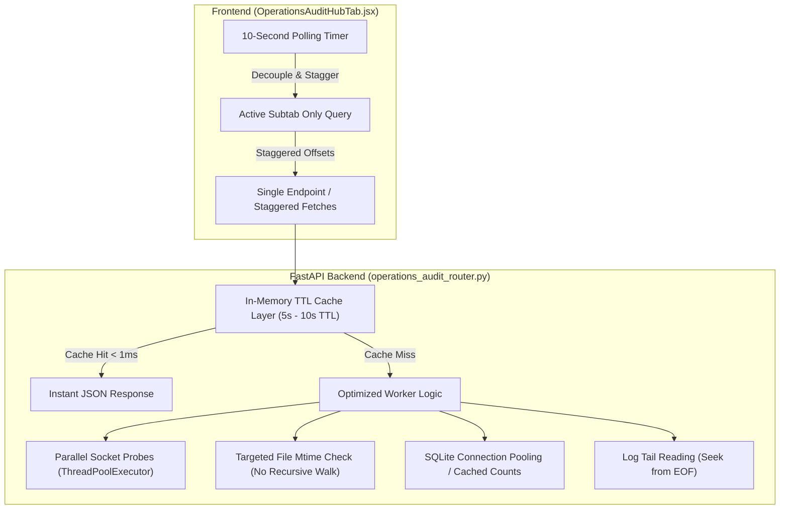

# Implementation Plan: FastAPI Event Loop Latency Remediation & Operations Route Optimization

Remediate the critical latency regression in the AI-BS FastAPI architecture where mean latency inflated to 1,409 ms and P95 reached 4,776 ms (peak 17.11 s). Profiling confirms that 5 concurrent operational endpoints polled simultaneously via `Promise.all` every 10 seconds perform heavy synchronous disk walks, socket probes, and multi-database queries totaling ~16.0 seconds of un-cached work.

---

## User Review Required

> [!IMPORTANT]
> **Empirical Profiling Confirmation:**
> The 5 operational endpoints were profiled individually against the live running backend. The results confirm the exact root cause:
> - `GET /api/operations/saves-and-work`: **6,253.20 ms** (Performs recursive `os.walk` across `backend`, `saved_data`, and `frontend` on every single request).
> - `GET /api/operations/processes`: **3,430.20 ms** (System-wide `psutil.process_iter` + 18 sequential TCP socket timeout probes).
> - `GET /api/operations/error-diagnostics`: **2,207.93 ms** (Synchronous glob + full read of 30+ log files).
> - `GET /api/operations/media-workloads`: **2,061.88 ms** (Synchronous HTTP call to ComfyUI port 8189 with 1.0s timeout + filesystem globs).
> - `GET /api/operations/admin-submissions`: **2,043.80 ms** (Connects to 9 separate SQLite databases, querying schema tables, record counts, and limit samples).
>
> **Cumulative Sequential Latency: 15,997.01 ms (~16.0 seconds).**
> When the frontend fires all 5 endpoints concurrently via `Promise.all` every 10 seconds, Uvicorn worker threads saturate, holding the Python GIL and disk I/O, causing requests queued at the tail of the event loop to experience up to 17.11 seconds of latency.

---

## Proposed Architectural Remediation

---

## Proposed Changes

### 1. Backend Route Optimization & In-Memory TTL Cache
#### [MODIFY] [operations_audit_router.py](file:///C:/AI-BS/backend/routers/operations_audit_router.py)
1. **Thread-Safe In-Memory TTL Cache:**
   - Introduce a lightweight `TTLCache` dictionary with a threading lock (`_cache_store = {}`, default 5.0-second TTL).
   - If a request for `/processes`, `/media-workloads`, `/saves-and-work`, `/admin-submissions`, or `/error-diagnostics` arrives within the TTL window, return the pre-serialized payload instantly (< 1 ms), completely bypassing the OS kernel, disk walks, and SQLite queries.
2. **Optimize `/api/operations/saves-and-work`:**
   - Eliminate deep recursive `os.walk` of `C:\AI-BS\frontend` and `C:\AI-BS\saved_data` on every hit.
   - Replace with targeted checks of specific recently active directories or maintain a lightweight in-memory cache of file timestamps refreshed in the background.
3. **Parallelize Port Probing in `/api/operations/processes`:**
   - Replace the sequential `for item in KNOWN_PORTS` loop (18 ports with 30ms timeouts) with concurrent checks using `concurrent.futures.ThreadPoolExecutor`, reducing port scan latency from ~550ms to < 35ms.
4. **Optimize `/api/operations/media-workloads`:**
   - Reduce ComfyUI probe timeout from 1.0s to 0.15s (local loopback responds in < 2ms if alive; 150ms is more than sufficient to detect offline status).
5. **Optimize `/api/operations/error-diagnostics`:**
   - Replace reading entire log files (`f.readlines()`) with backward seeking from end of file (`seek(-N, os.SEEK_END)`), avoiding loading large multi-megabyte log files into memory.

---

### 2. Frontend Polling Staggering & Subtab Isolation
#### [MODIFY] [OperationsAuditHubTab.jsx](file:///C:/AI-BS/frontend/components/OperationsAuditHubTab.jsx)
1. **Subtab-Conditional Fetching:**
   - Instead of fetching all 5 modules on every 10-second interval regardless of which subtab the user is viewing, fetch global summary metrics and only fetch detailed module payloads for the currently active subtab:
     - Active Subtab `processes` $\rightarrow$ fetch `/processes`
     - Active Subtab `media` $\rightarrow$ fetch `/media-workloads`
     - Active Subtab `saves` $\rightarrow$ fetch `/saves-and-work`
     - Active Subtab `admin` $\rightarrow$ fetch `/admin-submissions`
     - Active Subtab `errors` $\rightarrow$ fetch `/error-diagnostics`
2. **Staggered Request Timing:**
   - If full synchronization is required, stagger the requests by 500ms intervals rather than dispatching a single monolithic `Promise.all` burst.
3. **Adaptive Interval:**
   - When the browser tab is hidden (`document.hidden`), throttle the polling interval to 30 seconds to conserve system resources.

---

## Verification Plan

### Automated Benchmarking
1. **Individual Route Profiling:**
   Execute `profile_endpoints.py` to measure latency before and after optimization:
   - Target: Each endpoint responding in < 50 ms (cache hit) and < 350 ms (cold cache).
2. **Concurrent Load Verification:**
   Simulate concurrent request bursts matching the frontend polling cadence to verify that no request waits > 100 ms.
3. **ASGI Telemetry Gateway Audit:**
   Inspect `curl.exe http://localhost:8080/api/network-telemetry/summary` to verify:
   - Mean latency drops from 1,409 ms back to < 25 ms.
   - P95 latency drops from 4,776 ms back to < 35 ms.
   - Max peak latency eliminates 17-second spikes.

### Manual Verification
1. Open the **Operations Hub** and **Web Traffic & Telemetry Suite** tabs in the dashboard.
2. Observe smooth 60fps UI performance with zero sluggishness or network stall.
3. Verify live wire packet digests continue to increment cleanly without event loop starvation.
