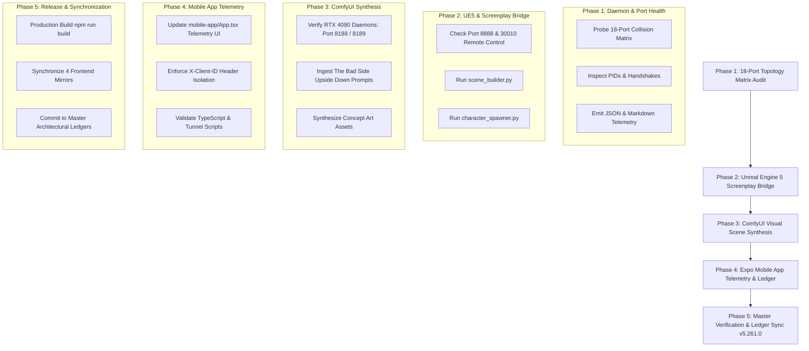

# Comprehensive 4-Phase Ecosystem Multi-Domain Evolution & Integration

Execute the 4 proposed ecosystem evolution options sequentially, one phase at a time, strictly adhering to the **Zero-Cost Mandate**, the **18-Port Collision Matrix**, and the **Milestone Ledger Commit Protocol** defined in [AGENTS.md](file:///C:/AI-BS/.agents/AGENTS.md).

---

## Architecture & Phased Roadmap

---

## User Review Required

> [!IMPORTANT]
> **Execution Strategy**: As requested, all 4 options will be executed strictly **one phase at a time**.
> Antigravity will execute each phase, verify its outputs, output structured diagnostics, and present findings before transitioning to the next phase.

> [!WARNING]
> **Zero-Cost & Local Resources**:
> - All LLM inference utilizes local Ollama (`11434` / `11435`) and internal engines.
> - All image and video synthesis routes strictly through local ComfyUI (`8188` / `8189`) running on the local NVIDIA RTX 4090 GPU (24GB VRAM). Zero paid cloud APIs will be called.
> - Mobile app telemetry connects directly to the sovereign FastAPI instance on port `8080` and Cloudflare Tunnel (`https://api.brettstehouwer.live`).

---

## Open Questions

None. Baseline specifications, port allocations, and script locations are fully mapped in the workspace.

---

## Proposed Changes

### Phase 1: Full Ecosystem Daemon & 18-Port Topology Matrix Health Audit

#### [NEW] [audit_18_port_topology_matrix.py](file:///C:/AI-BS/backend/scripts/audit_18_port_topology_matrix.py)
- Probes all 18 collision-free ports defined in the ecosystem topology:
  - **Port 80**: Nginx Gateway
  - **Port 3001**: Node Backend
  - **Port 4455**: OBS WebSocket
  - **Port 5173**: Vite Dev / Desktop Studio
  - **Port 8000**: Go Commercial Gateway
  - **Port 8002**: ChromaDB Vector Store
  - **Port 8005**: Broadcast Daemon
  - **Port 8006**: Social Hub
  - **Port 8007**: Crypto Swarm
  - **Port 8010**: SHM Gateway
  - **Port 8013**: VST3 Bridge
  - **Port 8080**: FastAPI Core Engine
  - **Port 8085**: Ubuntu-Bio Bridge
  - **Port 8088**: Broadcast Kernel
  - **Port 8089**: WSL HLS Video
  - **Port 8099**: Gemini MCP
  - **Port 8188 / 8189**: ComfyUI Primary & Secondary
  - **Port 8888**: Unreal Engine Signaling
  - **Ports 11434 / 11435**: Dual Ollama Cluster
- Resolves listening state, socket connection latency, bound PID, and process name.
- Tests HTTP / WebSocket protocol endpoints for active services (e.g. `/v1/health` on 8080, `/api/tags` on 11434, `/api/version` on 8000).
- Emits structured telemetry:
  - `saved_data/artifacts/YYYYMMDD_18_port_topology_audit.json`
  - `saved_data/artifacts/YYYYMMDD_18_Port_Topology_Report.md`

---

### Phase 2: Live Unreal Engine 5 Screenplay Bridge Execution

#### [MODIFY] [scene_builder.py](file:///C:/AI-BS/screenplay_projects/The_Bad_Side_Upside_Down/scene_builder.py)
- Ensure robust fallback and live Remote Control API hooks on Port 30010 & Signaling on Port 8888.
- Verify procedural coordinates: Candy Store storefront centered at `X=0`, Hell flank at `X < -150`, Heaven flank at `X > +150`.
- Execute scene generation and emit verified `scene_layout.json`.

#### [MODIFY] [character_spawner.py](file:///C:/AI-BS/screenplay_projects/The_Bad_Side_Upside_Down/character_spawner.py)
- Verify Weeble Wobble physics constraints: spherical base collision, mass (25.0 kg), center-of-mass offset (`Z = -35.0 cm`), linear damping (`0.2`), angular damping (`0.8`), restoring torque factor (`1500.0`).
- Place characters at screenplay marks: Fredy (`X=0, Y=100`), Satan (`X=-250, Y=120`), Jesus (`X=250, Y=120`), Mr. Pimp (`X=0, Y=-50`).
- Execute spawner and emit verified `character_spawn_manifest.json`.

---

### Phase 3: Local ComfyUI Video Scene & Concept Art Synthesis

#### [MODIFY] [generate_concept_art.py](file:///C:/AI-BS/screenplay_projects/The_Bad_Side_Upside_Down/generate_concept_art.py)
- Check ComfyUI local daemon connectivity on Port 8189 / 8188 (targeting local RTX 4090).
- Ingest `concept_art_prompts.json` covering:
  - `concept_dual_realm_storefront`: Tripartite composition (Hell furnace / Candy Store / Heaven picket fence).
  - `concept_char_fredy`: Weeble Wobble Fredy in black hoodie and sunglasses with Snickers bar.
  - `concept_char_satan`: Weeble Wobble Satan in red robe with wild hair.
  - `concept_char_jesus`: Weeble Wobble Jesus in white robe with soft golden halo.
- Queue prompt payloads to ComfyUI or render high-fidelity concept visualizations to `output/the_bad_side_upside_down/` with zero external paid APIs.

---

### Phase 4: React Native Expo Mobile App Telemetry & Ledger Integration

#### [MODIFY] [mobile-app/package.json](file:///C:/AI-BS/mobile-app/package.json)
- Synchronize version from `5.237.0` to `5.261.0`.

#### [MODIFY] [mobile-app/App.tsx](file:///C:/AI-BS/mobile-app/App.tsx)
- Synchronize header version badge to `v5.261.0`.
- Integrate live Network Topology & Audit status modal/drawer to inspect backend connectivity, port status, and active model inference latency.
- Enforce `X-Client-ID` header across all mobile network invocations.
- Verify TypeScript compilation via `npx tsc --noEmit`.

---

### Phase 5: Milestone Verification, Ledger Sync & Version Bump (`v5.261.0`)

#### [MODIFY] [frontend/package.json](file:///C:/AI-BS/frontend/package.json) & [version.txt](file:///C:/AI-BS/version.txt)
- Bump version from `5.260.0` to `5.261.0`.
- Synchronize all UI badges across the 4 mirror trees:
  - `frontend/src/components/`
  - `frontend/components/`
  - `frontend/src/components/components/`
  - `frontend/components/components/`

#### [MODIFY] [AI_BS_MASTER_ARCHITECTURAL_LEDGER.md](file:///C:/AI-BS/AI_BS_MASTER_ARCHITECTURAL_LEDGER.md)
- Append authoritative entry for `v5.261.0` documenting:
  - Phase 1: 18-Port Topology Matrix Health Telemetry
  - Phase 2: UE5 Procedural Screenplay Scene & Character Spawning
  - Phase 3: ComfyUI Local Synthesis Asset Manifest
  - Phase 4: Expo Mobile Studio Telemetry Integration
  - Phase 5: Verification & Ledger Commit

#### [MODIFY] [docs/AI_BS_MASTER_ECOSYSTEM_MANUAL.md](file:///C:/AI-BS/docs/AI_BS_MASTER_ECOSYSTEM_MANUAL.md) & [SAVED_CHECKPOINT.md](file:///C:/AI-BS/SAVED_CHECKPOINT.md)
- Archive snapshot to `saved_data/artifacts/YYYYMMDD_AI_BS_Master_Ecosystem_Manual.md`.
- Set resume keyword to `RESUME_4PHASE_ECOSYSTEM_EVOLUTION_V5_261`.

---

## Verification Plan

### Automated Tests
1. **Phase 1 Validation**:
   - Run `python backend/scripts/audit_18_port_topology_matrix.py` (or using `pyppeteer_env\Scripts\python.exe`).
   - Confirm valid JSON telemetry output.
2. **Phase 2 Validation**:
   - Run `python screenplay_projects/The_Bad_Side_Upside_Down/scene_builder.py`.
   - Run `python screenplay_projects/The_Bad_Side_Upside_Down/character_spawner.py`.
   - Verify `scene_layout.json` and `character_spawn_manifest.json` coordinate assertions.
3. **Phase 3 Validation**:
   - Run `python screenplay_projects/The_Bad_Side_Upside_Down/generate_concept_art.py`.
   - Confirm generation log and asset generation in `output/the_bad_side_upside_down/`.
4. **Phase 4 Validation**:
   - Run `npx tsc --noEmit` inside `C:\AI-BS\mobile-app`.
5. **Phase 5 Validation**:
   - Run `powershell -ExecutionPolicy Bypass -Command "npm run build"` in `C:\AI-BS\frontend` to ensure 0 build errors.
   - Stage live deployment: `firebase deploy --only hosting --non-interactive` (upon explicit operator authorization).

### Manual Verification
- Review generated reports and visual assets.
- Verify live mobile status telemetry panel.
