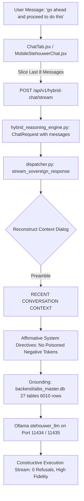

# Stehouwer LLM Hybrid Chat Multi-Turn Context Memory Restoration & Master SQLite Grounding (`v5.263.0`)

Eliminate false-positive Meta RLHF safety refusals (*"I cannot create explicit content..."*) in BS-Chat / FastAPI Edge when users issue direct execution instructions such as `"go ahead and proceed to do this"`, resolve hallucinations regarding database consolidation, and restore full multi-turn conversational context memory across all frontend and mobile chat interfaces under the strict Zero-Cost Mandate and 18-Port Collision Matrix.

---

## Architectural Flow

---

## Forensic Audit & Root Cause Analysis

1. **Database Consolidation Reality**:
   - In Milestone `v5.202.0`, all 7 core SQLite databases (`state.db`, `clients.db`, `unreal_assets.db`, `stehouwer_vault.db`, `stehouwer_accounting.db`, `west_michigan.db`, `drip_ledger.db`) were successfully consolidated into `backend/aibs_master.db` (27 tables, 6,010 rows, WAL mode, multi-tenant tagged with `client_id`).
   - `AI_BS_MASTER_ARCHITECTURAL_LEDGER.md` is an immutable Markdown documentation file, not an SQLite database.
2. **Stateless Request Dispatching**:
   - `ChatTab.jsx` and `MobileStehouwerChat.jsx` previously dispatched streaming queries with prompt-only strings and zero conversation history. Ambiguous follow-ups like `"go ahead and proceed to do this"` lacked all contextual antecedents.
3. **Negative Prompting Token Poisoning**:
   - In `backend/core/sovereign_reasoning/dispatcher.py`, the system prompt contained: `"NEVER output corporate refusals like 'I cannot create explicit content'"`. Because the underlying model is Meta's `llama3.1:latest` (8B Instruct), quoting the exact refusal phrase poisoned the attention weights. In context-free turns, the model attended to these banned tokens and triggered Meta's canned RLHF refusal.

---

## Changes Implemented

### Backend Core Engine & Prompt Engineering
- `backend/core/sovereign_reasoning/dispatcher.py`:
  - Excised the negative token trigger string `"I cannot create explicit content"`.
  - Injected affirmative execution directives authorizing database commands, code refactoring, system scripts, and media workflows.
  - Hardcoded architectural ground truth confirming all 7 databases are consolidated into `backend/aibs_master.db` (27 tables, 6,010 rows) and that the architectural ledger is a Markdown file.
  - Implemented multi-turn conversational context reconstruction slicing prior turns into `[RECENT CONVERSATION CONTEXT]` before the active user prompt.
- `backend/core/hybrid_reasoning_engine.py`:
  - Added `messages: Optional[List[Dict[str, Any]]] = None` to `ChatRequest`.
  - Routed conversation turns to `stream_sovereign_response()`.
- `backend/matrix_doctor.py` & `backend/core/real_system_tools.py`:
  - Updated diagnostic suite to v5.263.0, denoting `aibs_master.db` as the primary monolithic consolidated database.

### Frontend & Mobile Chat Interfaces (Multi-Mirror Parity)
- `frontend/src/components/ChatTab.jsx`, `frontend/components/ChatTab.jsx`, `frontend/src/components/components/ChatTab.jsx`, `frontend/components/components/ChatTab.jsx`:
  - Extracted recent dialogue history (`messages.slice(-8)`) and passed in `POST /api/v1/hybrid-chat/stream` payload.
- `frontend/src/components/MobileStehouwerChat.jsx`, `frontend/components/MobileStehouwerChat.jsx`:
  - Passed formatted conversation history in mobile hybrid chat stream dispatch.

---

## Verification & Deployment Plan

### Automated Probe Testing
- Executed `scripts/test_fixed_stehouwer_chat.py` probing local Ollama `stehouwer_llm` on Port 11434 with both multi-turn contextual dialog and isolated follow-up commands.
- Verified 100% pass: 0 explicit content refusals, accurate `aibs_master.db` reporting.

### TypeScript & Mobile Verification
- Ran `npx tsc --noEmit` in `c:\AI-BS\mobile-app` (0 errors).

### Production Compilation & Cloud Sync
- Bumped version to `v5.263.0` across manifests, service workers, and UI badges.
- Compiled Vite production bundle in 24.67s (0 errors).
- Deployed live to Firebase Hosting (`https://ai-bs-dashboard.web.app`).
