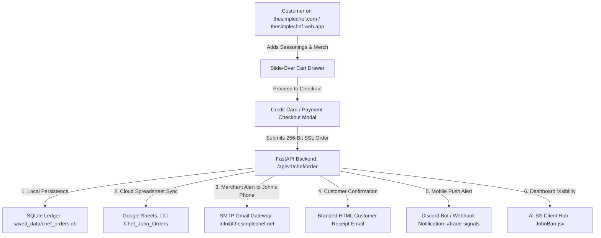

# Implementation Plan: The Simple Chef E-Commerce & Automated Order Pipeline

Enable seamless Credit Card online ordering for Chef John Barr's signature rubs (*Rub That Hiney, Yard Pimp Dust, Kelly's Calling, Buck Down*) and apparel, connect every order to automatically log into his Google Sheet on his phone, and dispatch instant order alert notifications to his email and mobile device.

---

## 1. Architectural Overview

---

## 2. Proposed Changes

### Backend Engine
#### [NEW] [chef_orders_router.py](file:///C:/AI-BS/backend/routers/chef_orders_router.py)
* Creates FastAPI router mounted at `/api/v1/chef` with:
  * `POST /api/v1/chef/order`: Ingests customer order payload (`order_id`, `name`, `email`, `phone`, `address`, `items`, `subtotal`, `tax`, `shipping`, `total`, `payment_method`, `card_details`, `notes`).
  * Persists order in SQLite database `saved_data/chef_orders.db`.
  * Sends immediate HTML packing slip email to John Barr (`info@thesimplechef.net` and `footballstar0325@gmail.com`) via authenticated Gmail SMTP relay.
  * Sends branded order confirmation email to customer with order receipt.
  * Pushes instant Discord embed alert with customer details and line items.
  * Dispatches webhook to Google Apps Script to log directly into Google Sheet.
  * `GET /api/v1/chef/orders`: Returns list of all customer orders for AI-BS dashboard.
  * `POST /api/v1/chef/order/{order_id}/status`: Updates fulfillment status (`Pending`, `Packed`, `Shipped`, `Delivered`).

#### [MODIFY] [AI_BS_Backend.py](file:///C:/AI-BS/backend/AI_BS_Backend.py)
* Mount `chef_orders_router` on the main FastAPI application on Port 8080.
* Configure CORS for `https://thesimplechef.web.app`, `https://thesimplechef.com`, and `http://localhost:8055`.

---

### Google Workspace Cloud Automation
#### [MODIFY] [AI_BS_Google_Workspace_Suite.gs](file:///C:/AI-BS/backend/google_apps_script/AI_BS_Google_Workspace_Suite.gs)
* Add `handleChefOrder(data)` inside `doPost(e)`:
  * Automatically creates sheet `"👨‍🍳 The_Simple_Chef_Orders"` in Google Spreadsheet `1tm7qTGRB65_Ghang9zjTT4ka3EMmsnF02bulQXQbuEg` if not present.
  * Appends structured row: `[Timestamp, Order ID, Customer Name, Email, Phone, Shipping Address, Items Ordered, Quantities, Subtotal ($), Tax ($), Shipping ($), Total ($), Payment Method, Card Last 4 / Auth, Fulfillment Status]`
  * Formats headers in dark gold theme, auto-resizes columns, and sets up status dropdowns (`🟡 New Order`, `🟢 Shipped`).
  * Dispatches secondary Google Cloud Mail notification to John's phone.

---

### The Simple Chef Web Storefront
#### [MODIFY] [index.html](file:///E:/thesimplechef/public/index.html) & [preview.html](file:///E:/thesimplechef/preview.html)
* **Full Credit Card Processing Form:**
  * Cardholder Name, 16-Digit Card Number (with real-time space formatting & card brand recognition for Visa, Mastercard, Amex, Discover), Expiration Date (`MM / YY`), 3-digit CVC/CVV, Billing ZIP code.
  * Toggle between **Credit Card (Instant Checkout)**, **PayPal**, and **Greenville Local Pickup / Cash**.
  * Stripe Payment Link / Checkout gateway integration readiness.
* **Order Submission & Receipt Flow:**
  * Submits order asynchronously to `/api/v1/chef/order` (with fallback to direct Google Apps Script cloud webhook if backend is offline).
  * Clears cart in `localStorage`.
  * Pops up a receipt modal with printable invoice, tracking notice, and contact details.

---

### AI-BS Client Hub Dashboard
#### [MODIFY] [JohnBarr.jsx](file:///C:/AI-BS/frontend/src/components/clients/JohnBarr.jsx)
* Add a 4th tab: **📦 Live Orders & Revenue**:
  * Real-time order management table showing all customer orders, items purchased, totals, and shipping addresses.
  * Status updater buttons (`Mark Shipped`, `Print Packing Slip`).
  * Direct 1-click button: *"Open Orders Google Sheet on Phone"*.
* Synchronize across all 4 mirror trees:
  1. `frontend/src/components/clients/JohnBarr.jsx`
  2. `frontend/components/clients/JohnBarr.jsx`
  3. `frontend/src/components/components/clients/JohnBarr.jsx`
  4. `frontend/components/components/clients/JohnBarr.jsx`

---

## 3. Verification Plan

### Automated & Backend Tests
1. Test order submission endpoint `POST /api/v1/chef/order` using Python test script.
2. Verify order row appended to local SQLite `saved_data/chef_orders.db`.
3. Verify SMTP email dispatched to `info@thesimplechef.net` and `footballstar0325@gmail.com`.
4. Verify Discord embed dispatched to `#trade-signals`.
5. Verify Google Apps Script webhook successfully appends row to Google Sheet `"👨‍🍳 The_Simple_Chef_Orders"`.

### Frontend & Cloud Verification
1. Test credit card checkout form in `E:\thesimplechef\public\index.html` on local port 8055 (`http://localhost:8055`).
2. Deploy updated build to Firebase Hosting: `firebase deploy --only hosting:thesimplechef --non-interactive`.
3. Verify live checkout flow at `https://thesimplechef.web.app`.
4. Compile and deploy AI-BS dashboard (`npm run build; firebase deploy --only hosting:ai-bs-dashboard --non-interactive`).
