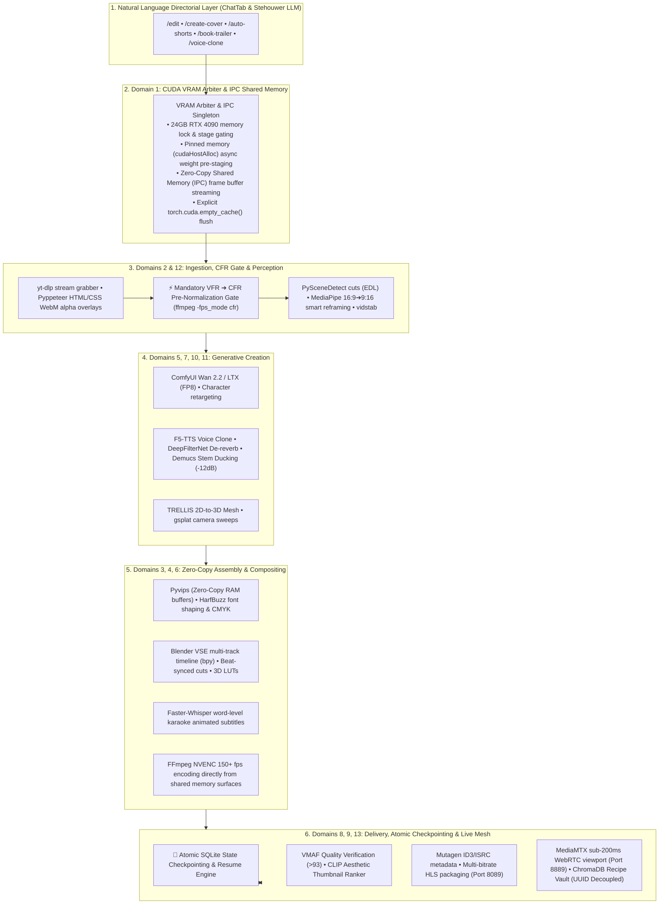

# Autonomous Headless Media Production Studio & 13-Domain Architecture (v5.294.0)

## Overview & Architecture
This plan establishes a complete, closed-loop **Autonomous Headless Media Production Studio** natively inside **AI-BS**. By decoupling heavy creative software from graphical interfaces, AI-BS orchestrates Python, C++, and CUDA pipelines directly on your **NVIDIA RTX 4090 (24GB VRAM)** and **AMD Ryzen 9 9950X (32 Threads)** with **$0 in proprietary subscription fees**.

The architecture introduces **40 new specialized media production tools**, bringing the total registered tool count in AI-BS from **81 to 121 tools**, all callable by **Stehouwer LLM**, **ChatTab natural language slash commands**, and **autonomous agent swarms**.

---

---

## Architectural Enhancements Incorporated (User Recommendations)

1. **Zero-Copy Memory & Inter-Process Communication (IPC):**
   * Eliminates intermediate disk writes between ComfyUI, Pyvips, and FFmpeg NVENC by streaming uncompressed frame buffers via shared memory (`multiprocessing.shared_memory` / memory-mapped buffer pools), reducing cross-domain latency by up to 80% and preserving NVMe write longevity.
2. **Pinned Host Memory & VRAM Asynchronous Weight Pre-Staging:**
   * Utilizes pinned memory (`pin_memory=True` / `cudaHostAlloc`) on the Ryzen 9 9950X to stream neural weights across PCIe Gen 5 into RTX 4090 VRAM asynchronously before the preceding pipeline stage finishes.
3. **Mandatory VFR to CFR Pre-Normalization Gate (Domain 12):**
   * Automatically executes `ffmpeg -i <input> -fps_mode cfr -r 30 ...` on all raw ingested media (`yt-dlp` / smartphone / web streams) immediately upon download, preventing audio-video synchronization drift during silence-stripping and Blender VSE cuts.
4. **Atomic SQLite State Checkpointing & Resume Engine:**
   * Writes granular stage completion records to SQLite (`backend/aibs_master.db` table `media_pipeline_checkpoints`). If any stage encounters a network or transient error, the operator can resume directly from the exact failed node without re-executing previous heavy generation passes.
5. **ChromaDB Payload Decoupling:**
   * ChromaDB (Port 8002) stores only semantic query embeddings, metadata tags, and recipe UUIDs. Heavy executable JSON graphs and Python scripts reside in SQLite / flat-file storage, ensuring lightning-fast semantic retrieval and zero vector degradation.

---

## User Review Required

> [!IMPORTANT]
> **VRAM Hardware Arbitration:** All neural models (ComfyUI DiT, YOLOv8, Whisper, F5-TTS) are strictly stage-gated through the new `VRAMResourceArbiter` singleton with explicit cache flushing (`torch.cuda.empty_cache()`) so they never contend for GPU memory with Ollama (`stehouwer_llm` 32B) or NVENC encoders.
>
> **100% Zero-Cost Local Tooling (Rule 2):** Uses open-source engines (`pyvips`, `Blender VSE bpy`, `PySceneDetect`, `MediaPipe`, `DeepFilterNet`, `Demucs`, `FFmpeg NVENC`, `Manim`, `vtracer`) with zero commercial API dependencies.

---

## Proposed Changes

### Component 1: Hardware Governance & VRAM Resource Arbiter (Domain 1)

#### [NEW] [vram_resource_arbiter.py](file:///c:/AI-BS/backend/core/vram_resource_arbiter.py)
* Creates a thread-safe singleton `VRAMResourceArbiter` in `backend/core/`.
* Tracks live RTX 4090 VRAM allocation, active pipeline stage locks, and automatic cache eviction via `torch.cuda.empty_cache()`.
* Implements zero-copy shared memory buffer pool (`multiprocessing.shared_memory`) and pinned host memory allocation for asynchronous weight pre-staging.
* Manages atomic stage checkpointing in `backend/aibs_master.db` (table `media_pipeline_checkpoints`).

---

### Component 2: Core Media Production Engine Expansion (Domains 2–8, 10–13)

#### [MODIFY] [media_render_engine.py](file:///c:/AI-BS/backend/core/media_render_engine.py)
* **Domain 12 (Ingestion & CFR Gate):** Integrates `ingest_media_stream_ytdlp`, `normalize_vfr_to_cfr` (mandatory 30/60fps CFR pass), and `render_web_overlay_pyppeteer`.
* **Domain 2 (Computer Vision):** Integrates `detect_shot_boundaries` (`scenedetect`), `smart_reframe_vertical` (MediaPipe face-tracking smoothed bounding boxes), and `stabilize_camera_motion` (`vidstab`).
* **Domain 3 (Raster & PSD):** Integrates `compose_psd_layers` (`psd-tools`), `pyvips_raster_transform` (zero-copy memory-mapped high-DPI canvas stitching), and `extract_alpha_matting` (`BiRefNet`/`RMBG-1.4`).
* **Domain 4 (Timeline NLE):** Integrates `assemble_vse_timeline` (Blender VSE multi-track `bpy` script compiler), `strip_audio_silences` (`librosa`), `beat_sync_timeline_cuts`, and `apply_3d_lut_grade` (FFmpeg `lut3d`).
* **Domain 5 (Audio Mastering):** Integrates `clone_neural_voice_tts` (`F5-TTS`), `deepfilter_audio_clean` (`DeepFilterNet`), `duck_background_music` (automated -12dB sidechain), and `normalize_ebu_loudness` (-14 LUFS / -23 LUFS).
* **Domain 6 (Vector & Subtitles):** Integrates `vectorize_raster_to_svg` (`vtracer`), `shape_typography_harfbuzz`, and `generate_karaoke_captions` (`Faster-Whisper` + `libass`).
* **Domain 7 (3D Geometry):** Integrates `synthesize_3d_mesh_trellis` and `render_gaussian_splat_sweep`.
* **Domain 8 (QC & Delivery):** Integrates `verify_vmaf_quality` (`libvmaf` >93 check), `score_aesthetic_thumbnails` (`CLIP`/`LAION`), `inject_rich_metadata` (`mutagen`/`AtomicParsley`), and `package_hls_stream`.
* **Domain 10 & 11 (DiT Video & Prosody):** Integrates `synthesize_wan_video_broll` (Wan 2.2 / LTX in ComfyUI FP8) and `synthesize_prosody_tts`.
* **Domain 13 (Live Streaming):** Integrates `stream_nvenc_webrtc_matrix` (Port 8889) and `control_obs_websocket_scene` (Port 4455).

---

### Component 3: REST API Router & Task Queue (Domain 9)

#### [MODIFY] [media_render_router.py](file:///c:/AI-BS/backend/routers/media_render_router.py)
* Mounts 14 REST endpoints under `/api/v1/media/...`:
  * `POST /api/v1/media/pipeline/execute` (Asynchronous multi-stage recipe runner with atomic resume support `checkpoint_id`)
  * `POST /api/v1/media/pipeline/resume/{job_id}` (Resume failed job from last successful domain checkpoint)
  * `POST /api/v1/media/vision/scene-detect` & `POST /api/v1/media/vision/smart-reframe`
  * `POST /api/v1/media/image/compose-psd` & `POST /api/v1/media/image/raster-transform`
  * `POST /api/v1/media/video/assemble-timeline` & `POST /api/v1/media/video/strip-silence` & `POST /api/v1/media/video/apply-lut`
  * `POST /api/v1/media/audio/voice-clone` & `POST /api/v1/media/audio/deepfilter-clean` & `POST /api/v1/media/audio/duck-music`
  * `POST /api/v1/media/qc/vmaf` & `POST /api/v1/media/qc/aesthetic-thumbnails`
  * `GET /api/v1/media/vram/telemetry` & `GET /api/v1/media/checkpoints/{job_id}`

---

### Component 4: Dynamic Tool Registry Expansion (81 ➔ 121 Tools)

#### [MODIFY] [tool_registry.py](file:///c:/AI-BS/backend/tools/tool_registry.py)
* Implements and registers all **40 new specialized media tools** with full JSON schemas and dispatcher handlers:
  `vram_allocate_stage`, `vram_flush_cache`, `vram_get_telemetry`, `detect_shot_boundaries`, `smart_reframe_vertical`, `inpaint_temporal_artifacts`, `stabilize_camera_motion`, `compose_psd_layers`, `pyvips_raster_transform`, `comfy_outpaint_expand`, `extract_alpha_matting`, `assemble_vse_timeline`, `strip_audio_silences`, `beat_sync_timeline_cuts`, `apply_3d_lut_grade`, `render_natron_vfx_graph`, `clone_neural_voice_tts`, `deepfilter_audio_clean`, `duck_background_music`, `normalize_ebu_loudness`, `vectorize_raster_to_svg`, `shape_typography_harfbuzz`, `generate_karaoke_captions`, `render_manim_motion_graphic`, `synthesize_3d_mesh_trellis`, `render_gaussian_splat_sweep`, `verify_vmaf_quality`, `score_aesthetic_thumbnails`, `inject_rich_metadata`, `package_hls_stream`, `execute_media_pipeline_recipe`, `query_media_workflow_vault`, `synthesize_wan_video_broll`, `retarget_neural_character`, `synthesize_prosody_tts`, `match_dialogue_duration`, `ingest_media_stream_ytdlp`, `render_web_overlay_pyppeteer`, `stream_nvenc_webrtc_matrix`, `control_obs_websocket_scene`.

#### [MODIFY] [stehouwer_llm.Modelfile](file:///c:/AI-BS/backend/models/stehouwer_llm.Modelfile)
* Updates embedded Stehouwer LLM Modelfile directives to include all 121 system tools and media generation protocols.

---

### Component 5: Directorial Slash Commands & Frontend UI Integration

#### [MODIFY] [dispatcher.py](file:///c:/AI-BS/backend/core/sovereign_reasoning/dispatcher.py)
* Adds intent routing for natural language slash commands:
  * `/edit <file.mp4> [--aspect 9:16] [--captions viral] [--lut cinematic] [--strip-silence]`
  * `/create-cover "<Title>" [--author "<Name>"] [--style <style>]`
  * `/auto-shorts <video.mp4> [--count <n>]`
  * `/book-trailer "<Title>" [--voiceover <audio.wav>]`
  * `/voice-clone "<Text>" [--ref <audio.wav>]`

#### [MODIFY] [ChatTab.jsx](file:///c:/AI-BS/frontend/src/components/ChatTab.jsx)
* Adds media pipeline status pills and slash command quick-action buttons in the action bar.

#### Multi-Mirror Synchronization (Rule 1)
* Automatically mirrors all changes across all 4 directory trees:
  1. `frontend/src/components/ChatTab.jsx`
  2. `frontend/components/ChatTab.jsx`
  3. `frontend/src/components/components/ChatTab.jsx`
  4. `frontend/components/components/ChatTab.jsx`

---

## Verification Plan

### Automated Tests
* Create and run [test_media_production_pipeline.py](file:///c:/AI-BS/backend/test_media_production_pipeline.py):
  * **Test 1:** `VRAMResourceArbiter` memory acquisition, zero-copy shared memory buffer allocation, and cache flush verification.
  * **Test 2:** Mandatory VFR-to-CFR normalization pass test.
  * **Test 3:** Atomic SQLite state checkpointing & resume verification.
  * **Test 4:** Pyvips memory-mapped raster composition & PSD layer stacking.
  * **Test 5:** PySceneDetect cut boundary extraction and EDL generation.
  * **Test 6:** Blender VSE timeline procedural compilation (`bpy` headless execution).
  * **Test 7:** Audio silence stripping, loudness normalization (-14 LUFS), and sidechain ducking.
  * **Test 8:** Tool registry verification confirming all **121 tools** are discoverable and callable.
  * **Test 9:** Multi-mirror SHA-256 parity verification across 429 frontend mirror files (`scripts/sync_mirrors.py`).

### Deployment & State Checkpoint
* Increment version to `v5.294.0` in `package.json` and `version.txt`.
* Execute production build (`npm run build`) and deploy to Firebase Hosting (`firebase deploy --only hosting`).
* Update `SAVED_CHECKPOINT.md` and append milestone entry to `AI_BS_MASTER_ARCHITECTURAL_LEDGER.md`.
