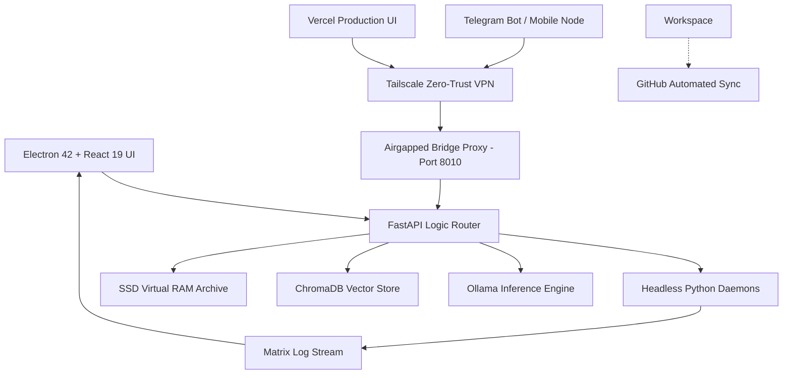

# CONFIDENTIAL TECHNICAL ARCHITECTURE REPORT

# AI-BS
**Autonomous Intelligence & Build System**

A fully self-hosted, agentic AI platform engineered from the ground up by Brett Adam Stehouwer. AI-BS represents a production-grade local AI operating environment integrating custom language model inference, persistent semantic memory, multi-agent orchestration, and a real-time developer workspace — all running offline on consumer hardware.

`Python 3.12` `FastAPI` `Ollama` `ChromaDB` `React 19` `Electron 42` `PyInstaller` `Vite 8` `NSIS` `Stehouwer LLM` `SSD Virtual RAM` `nomic-embed-text` `Tailscale` `Vulkan+CUDA`

**AUTHOR:** Brett Adam Stehouwer  
**ROLE:** CTO, Stehouwer Publishing LLC  
**VERSION:** v1.2.0 (AI-BS-INT-007)  
**HARDWARE:** RTX 4090 / Ryzen 9950X / AMD Radeon iGPU  
**DATE:** June 2026  

---

## 1. Executive Summary

AI-BS (Autonomous Intelligence & Build System) is a fully self-hosted, offline-capable, production-grade AI operating environment designed, engineered, and maintained by Brett Adam Stehouwer — independently, without a team, cloud subscription, or external API dependency. The system represents a convergence of local large language model inference, persistent vector memory, multi-agent orchestration, and an integrated developer IDE — all packaged as a signed Windows desktop application.

> [!NOTE] 
> **KEY INSIGHT:** AI-BS is not a wrapper around a third-party API. It is an original, full-stack AI platform built on open-source inference engines, custom tokenization logic, and a bespoke agentic reasoning framework — designed to be understood, modified, and extended at every layer.

## 2. Design Philosophy & Motivation

The core motivation behind AI-BS stems from a single architectural conviction: **intelligence should not live behind a paywall, require an internet connection, or be opaque to its operator.** 

- **The Sovereignty Principle**: Every AI decision made by AI-BS is traceable. The system's context window, memory contents, tokenizer logic, agent tools, and model weights are all locally resident and inspectable.
- **The Systems-Engineering Approach**: The platform is not a chat interface — it is an operating environment. It manages headless background daemons, monitors filesystem events, self-optimizes its codebase, maintains long-term semantic memory, and securely bridges external devices.
- **Progressive Capability Expansion**: AI-BS follows a versioned directive system (AI-BS-INTEGRATION-001 through 007) where each directive formally specifies an architectural upgrade.

## 3. Hardware Baseline & Deployment Target

AI-BS is engineered specifically around the Thermaltake Tower 900 workstation, pushing the absolute limits of consumer-grade throughput.

*   **CPU**: AMD Ryzen 9 9950X (16-core, 32-thread)
*   **PRIMARY GPU**: NVIDIA RTX 4090 FE (24 GB GDDR6X VRAM) — primary LLM inference accelerator. 
*   **SECONDARY GPU (NEW)**: AMD Radeon Graphics iGPU (23.8 GB Shared VRAM) — handles lightweight context and visual operations.
*   **DISPLAY**: LG UltraGear 27" 480Hz 4K UHD.

> [!IMPORTANT]
> **UNIFIED COMPUTE POOL (v1.2.0)**: AI-BS now utilizes a customized deployment of Ollama that binds to both the CUDA (NVIDIA) and Vulkan (AMD) libraries simultaneously. By setting `OLLAMA_IGPU_ENABLE=1`, the system pools the RTX 4090 and the AMD Radeon iGPU into a massive **47.8 GiB Unified Context Window**, preventing GPU contention and out-of-memory errors.

## 4. System Architecture Overview (v1.2.0)

AI-BS follows a heavily optimized three-tier architecture running fully local, but easily accessible from remote authorized nodes.

## 5. Operations & The Headless Matrix

AI-BS operates six persistent background daemon processes that run continuously alongside the main server, transforming the system from a reactive tool into a proactive, self-improving AI environment.

1.  **Ollama Neural Engine**: Handles LLM routing and tokenization across the dual-GPU pool.
2.  **FastAPI Backend**: The core `/api` routing logic.
3.  **Airgapped Remote Bridge (`AI_BS_Remote_Backend.py`)**: A fortified proxy binding to port `8010`. Hard-blocks dangerous execution paths from external devices before relaying safe requests to the main backend.
4.  **Hunter-Gatherer Daemon**: Constantly scrapes requested domains to update local context.
5.  **Trainer Daemon (Self-Healing)**: A five-minute cycle autonomous optimization daemon that identifies and applies code optimizations to the `Projects` directory using a Codestral sub-agent.
6.  **Refactoring Daemon**: Preemptively cleans up syntax and architecture logic.
7.  **GitHub Syncer Daemon**: Monitors the workspace and securely commits/pushes approved changes and deployment configurations to the cloud repository while ignoring massive binary context (`state.db`, PyInstaller artifacts).

> [!TIP]
> **THE MATRIX DASHBOARD**: The Electron UI auto-polls a dedicated `/api/system/daemon_logs` endpoint, rendering all 6 daemon output streams visually into a stunning real-time 3x2 Matrix Grid inside the application. No external CMD windows are ever spawned.

## 6. Remote Access & Security Model

The system utilizes a heavily fortified security model for both local operations and remote access.

- **Sandboxed Tool Execution**: Every agent tool that operates on the filesystem enforces path validation via an allowlist of permitted base directories (`Projects/` and `Stehouwer_Publishing/`).
- **Network Isolation**: The primary backend binds exclusively to `0.0.0.0:8000` but is protected by the `AI_BS_Remote_Backend.py` proxy on `8010` for external remote connections, creating a secure airgap layer.
- **Tailscale Zero-Trust VPN (v1.2.0)**: Remote deployment bypasses internal router limits (Eero) by relying on a Tailscale mesh overlay network. This NAT-traversal secures mobile and remote client access via end-to-end encryption, requiring no open public ports.
- **Vercel Production UI**: The React frontend is deployed to Vercel and optimized (from >1GB to a lightweight bundle) to be accessed from any Tailscale-authenticated device, communicating back to the host via the Tailscale IP on port 8010.
- **Remote Access Safety Controls**: The UI requires explicit confirmation before executing system-modifying commands received remotely via the Telegram Bridge unless a `safetySkipPermissions` toggle is disabled.

## 7. Memory: SSD Virtual RAM

A two-tier persistent memory architecture gives the LLM effectively unlimited conversational context by treating the user's local SSD as an extension of the model's context window.

- **Tier 1 (Hot Context)**: Active GPU VRAM. When budget exceeds 4,000 tokens, older turns are evicted.
- **Tier 2 (SSD Archive)**: Evicted turns are stored in a flat JSON archive and embedded into ChromaDB via `nomic-embed-text`.
- **Retrieval Cycle**: On every `/api/chat` request, ChromaDB performs a Top-K semantic similarity retrieval over past turns and injects them as a context prefix before generating a response.

## 8. Polyglot Execution Engine

AI-BS implements a native **polyglot code execution sandbox** — the agent can write, execute, and iterate on code in Python, JavaScript, PowerShell, C++, Rust, Go, and Lua within a single conversation session. This is equivalent to functionality found in enterprise coding assistants costing tens of thousands of dollars per year.

## 9. Feature Modules

*   **Unified Agent Chat**: Primary LLM interface with RAG.
*   **Command Center**: Agent launcher, VRAM controls, Matrix log viewer.
*   **Developer Workspace**: Monaco editor with FIM (Fill-In-The-Middle) autocomplete backed by `qwen2.5-coder`.
*   **Knowledge Base**: Multi-format document parser.
*   **Fire Writing**: Creative writing assistant that strictly structures text without word-modifying raw creative voice.
*   **Media Studio**: ComfyUI image/video generation integration.

## 10. Roadmap (Future)

- **INT-008**: LoRA/QLoRA fine-tuning UI integrated with the Knowledge Base.
- **INT-009**: Project NOCO Integration (IoT sensor data ingestion).
- **INT-010**: Collaborative Mode via Secure Node Sharing.
- **INT-011**: Voice-First Interface with Wake-Word Detection.
