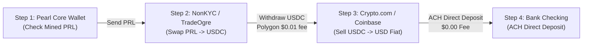

# 🏦 SoFi Bank Direct Deposit & 4-Step Crypto Cash-Out Walkthrough

## Executive Summary
This document provides the exact operational procedure for linking your **SoFi Bank** checking account to your regulated crypto off-ramp (**Crypto.com** or **Coinbase**), executing the 4-step cash-out process from your mined Pearl balance, and logging the records in the newly deployed **Crypto Accounting & Transfers** tab on `https://ai-bs-dashboard.web.app`.

---

## 🏛️ Verified SoFi Bank Information
The following verified banking credentials are configured in your AI-BS accounting ledger for zero-fee ACH direct deposits:

| Parameter | Configuration Value | Status |
| :--- | :--- | :--- |
| **Bank Name** | **SoFi Bank, N.A.** | Verified |
| **9-Digit Routing Number (ABA)** | `[REDACTED / SECURE]` | Verified |
| **Checking Account Number** | `[REDACTED / SECURE]` | Verified |
| **Account Type** | **Checking** | Standard ACH |
| **ACH Transfer Fee** | **$0.00 (100% Free)** | Standard ACH |
| **ACH Delivery Speed** | **1 to 3 business days** | Standard Direct Deposit |
| **Target USDC Address (Polygon)** | `0x4761aD28A8A6b0F5F66E0825a03AA419376152aa` (Crypto.com) | Live in `backend/.env` |
| **Exchange PRL Deposit Address (SafeTrade)** | `prl1p8e3ar3mje25fez4vl76wng3yzxzh7d8czyuvxtxlydhk6hkmf4kqulwrgn` | Live in `backend/.env` & Dashboard |

---

## 📱 Phase 1: Link SoFi Bank in Your Off-Ramp App

Choose your preferred off-ramp mobile application (Crypto.com or Coinbase):

### Option A: In the Crypto.com App (Recommended for Polygon USDC)
1. **Open the Crypto.com App** on your smartphone.
2. Tap **Accounts** (bottom navigation bar) > tap **Fiat Wallet**.
3. If this is your first time: Tap **Set Up New Currency** > Select **US Dollars (USD)** and accept the terms of use.
4. Tap **Transfer** > **Withdraw** > **USD**.
5. Tap **+ Add Bank Account**.
6. **Connect via Plaid (Fastest):**
   - Search for **SoFi**.
   - Enter your SoFi username and password. Plaid will instantly verify your routing and checking account.
7. **Manual Setup (If Plaid is skipped):**
   - Bank Name: `SoFi Bank`
   - Routing Number: `[REDACTED / SECURE]`
   - Account Number: `[REDACTED / SECURE]`
   - Account Type: `Checking`
   - Account Holder Name: Your legal name (must match Crypto.com profile).
8. Once verified, SoFi Bank is permanently linked for unlimited $0 ACH direct deposits.

### Option B: In the Coinbase App
1. Open the **Coinbase App** on your phone.
2. Tap your profile icon (top left) > tap **Payment Methods**.
3. Tap **Add a payment method** > Select **Bank Account**.
4. Search **SoFi** via Plaid, log in, and select your Checking Account.
5. SoFi Bank is now linked for ACH direct deposits.

---

## ⚡ Phase 2: The 4-Step Cash-Out Execution Walkthrough

---

### Step 1: Check Your Mined Pearl Balance
1. Open your **Pearl Core Desktop Wallet** on Windows (or check `prl1p5r4kvz636h2pa9fuww723s4r02flt25rec9qs6yjckk7lyejkvjs67a4n5` on the Pearl explorer).
2. Confirm your mined PRL balance from the active mining daemon (`task-4056` running on your RTX 4090 at ~290 TH/s).
3. Decide the amount of PRL you want to cash out (e.g., 500 PRL or 1,000 PRL).

---

### Step 2: Swap PRL for USDC on the Exchange
1. Log in to your trading exchange account:
   - **NonKYC.io** or **TradeOgre.com**.
2. Navigate to **Wallet / Assets** > Click **Deposit** > Search **PRL**.
3. Copy your unique **PRL Deposit Address** generated by the exchange.
4. Go to your **Pearl Desktop Wallet** > Click **Send**:
   - **Pay to:** Paste the exchange PRL deposit address.
   - **Amount:** Enter the PRL amount to send.
   - Click **Send**.
5. Wait ~5–10 minutes for block confirmations on the Pearl blockchain.
6. Once the PRL shows in your exchange balance:
   - Go to the **PRL/USDT** or **PRL/USDC** spot market.
   - Select **Market Order** > Set 100% > Click **Sell PRL**.
   - Your balance is now converted into stablecoins (USDC/USDT).

---

### Step 3: Withdraw USDC to Crypto.com / Coinbase
1. On the exchange, navigate to **Withdraw** > Select **USDC**.
2. **Crucial - Select Network:** Choose **Polygon (POL)** or **Base** (network fee is typically ~$0.01 to $0.05).
   > [!WARNING]
   > Do NOT select Ethereum ERC-20 unless required, as gas fees on Ethereum can be $5–$15. Polygon and Base are sub-cent.
3. In your **Crypto.com App** (or Coinbase):
   - Tap **Transfer** > **Deposit** > **Crypto** > **USDC**.
   - Select **Polygon** as the network.
   - Verify it matches `0x4761aD28A8A6b0F5F66E0825a03AA419376152aa`.
4. On the exchange, paste `0x4761aD28A8A6b0F5F66E0825a03AA419376152aa` into the withdrawal address field.
5. Click **Submit Withdrawal**.
6. The funds arrive in your mobile app in 1 to 3 minutes.

---

### Step 4: Convert USDC to USD & Direct Deposit to SoFi Bank
1. Open the **Crypto.com App** (or Coinbase).
2. Go to **Crypto Wallet** > tap **USDC** > tap **Sell**.
3. Select **USD Fiat Wallet**:
   - Enter the USDC amount.
   - Tap **Sell USDC** ($0 trading fee, 1:1 conversion).
4. Tap **Accounts** > **Fiat Wallet** > tap **Transfer** > **Withdraw** > **USD**.
5. Select **Bank Checking (ACH)**.
6. Enter the dollar amount you wish to direct-deposit.
7. Tap **Confirm Withdrawal**:
   - **Fee:** **$0.00**
   - **Method:** **ACH Direct Deposit**
   - **Arrival:** **1 to 3 business days** directly into your checking account.

---

## 📊 Phase 3: Track & Record in AI-BS Dashboard

To ensure IRS Form 8949 / Schedule C compliance and keep all accounting under one roof:

1. Open your live dashboard: **`https://ai-bs-dashboard.web.app`**.
2. Click **Crypto Hub** in the sidebar.
3. Click the new 5th tab: **Crypto Accounting & Transfers**.
4. In the top bar, you will see your linked **Linked Checking Account (ACH)** card and Polygon USDC address with 1-click copy buttons.
5. Use the **1-Click Quick Preset** buttons to log each leg of your transaction:
   - ⛏️ **Log Mined Income**: Records mined Pearl block rewards as gross business income.
   - 🔄 **Log Exchange Deposit**: Records moving PRL from your local wallet to the exchange.
   - 💱 **Log USDC Swap**: Records the token swap and cost basis.
   - 🏛️ **Log SoFi ACH Cashout**: Records the final direct deposit arriving in your SoFi checking account.
6. When quarterly tax time arrives, click **Export Tax CSV** at the top right to download a clean spreadsheet ready for your accountant or tax software.

---

## ⚠️ Recommended Best Practice for First-Time Run
> [!TIP]
> **First-Time $5 Test Run:**
> For your very first transfer, test the full loop with a small amount (~$5 to $10 of PRL). Once you see the $5 appear in your SoFi checking account via ACH, you will have 100% confidence in the operational pipeline for all future mining and compute cash-outs.
