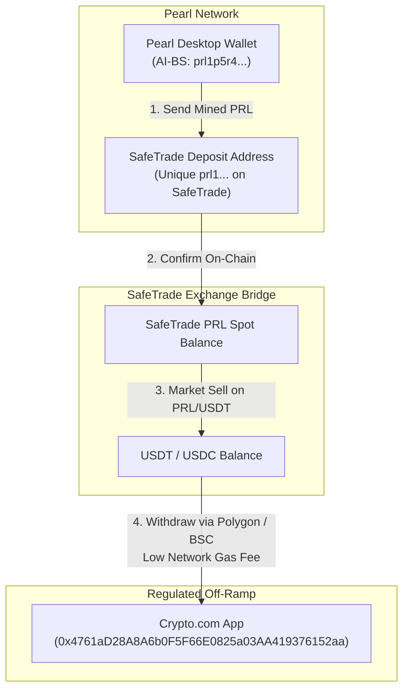

# 🪙 Step 2: Exchange Bridge Setup Guide (Pearl -> Stablecoins)

## Executive Summary
This document provides the exact operational procedure for setting up your trading exchange account on **SafeTrade** (`https://safe.trade`), which is the primary market listing for **Pearl (PRL)**. 

Because regulated US platforms (Crypto.com and Coinbase) do not support Layer-1 Pearl blockchain transactions directly, SafeTrade acts as the intermediary bridge to convert mined **PRL** into **USDT / USDC** before cash-out to SoFi Bank.

---

## 🗺️ Visual Architecture of Step 2



---

## 🛠️ Step-by-Step Execution Guide

### Sub-Step 2.1: Create Your Account on SafeTrade
1. Open your browser and navigate to:  
   👉 **[https://safe.trade/signup](https://safe.trade/signup)**
2. Fill in the registration form:
   - **Email:** Your preferred personal/business email.
   - **Password:** A strong, unique password.
   - Accept terms of service and click **Sign Up**.
3. **Verify Email:** Open your email inbox, find the verification email from SafeTrade, and click the confirmation link.
4. **Log In:** Return to `https://safe.trade/login` and sign in.

---

### Sub-Step 2.2: Enable 2FA Security (Mandatory for Withdrawals)
Exchanges require Two-Factor Authentication (2FA) before allowing withdrawals of funds:
1. Click your profile avatar / email in the top right corner > select **Security** (or **Account Settings**).
2. Locate **Two-Factor Authentication (2FA)**.
3. Open **Google Authenticator** (or Microsoft Authenticator / 1Password) on your phone.
4. Scan the QR code displayed on the screen.
5. Save the emergency backup recovery key written below the QR code in a safe location.
6. Enter the 6-digit code from your phone app to confirm. 2FA is now activated.

---

### Sub-Step 2.3: Generate & Copy Your Pearl (PRL) Deposit Address
1. In the top navigation bar, click **Wallets** (or **Balances** / **Funds**).
2. In the search box, type: `PRL`.
3. Locate **Pearl (PRL)**.
   > [!IMPORTANT]
   > Verify the asset name is **Pearl (PRL)** (Layer-1 AI Proof-of-Useful-Work).
4. Click the **Deposit** button next to Pearl.
5. **Your Verified SafeTrade PRL Deposit Address:**
   ```text
   prl1p8e3ar3mje25fez4vl76wng3yzxzh7d8czyuvxtxlydhk6hkmf4kqulwrgn
   ```
   *(This address is permanently bound into your AI-BS environment, backend `.env`, and Crypto Accounting Tab).*

---

### Sub-Step 2.4: Transfer Mined PRL from Desktop Wallet to SafeTrade
*(Perform this once your HeroMiners pool rewards reach 1.0 PRL and disburse to your Pearl Desktop Wallet)*
1. Open your **Pearl Desktop Wallet** on Windows.
2. Click **Send**.
3. In the **Pay To / Destination** field, paste your copied SafeTrade PRL deposit address.
4. In the **Amount** field, enter the amount of PRL you wish to convert:
   - *Recommendation:* For your very first transfer, test with a small amount (~2 to 5 PRL).
5. Click **Send Transaction**.
6. Wait ~5 to 10 minutes for block confirmations. Once confirmed, your PRL will appear in your SafeTrade balance.

---

### Sub-Step 2.5: Market Sell PRL to USDT
1. In SafeTrade, navigate to **Exchange** or **Trade** > select **PRL/USDT**  
   *(Direct URL: `https://safe.trade/trading/prlusdt`)*.
2. Look at the order placement panel below the chart:
3. Select **Market** tab (to execute immediately at the best available bid price).
4. In the **Sell PRL** box:
   - Click **100%** (or type the amount of PRL you deposited).
5. Click **Sell PRL**.
6. The transaction executes instantly, and your account now holds **USDT (Tether USD)**.

---

### Sub-Step 2.6: Withdraw USDT/USDC to Crypto.com / Coinbase
1. Go back to **Wallets** > search **USDT** > click **Withdraw**.
2. **Network Selection:**
   - Select a low-fee network: **Polygon (POL)**, **Base**, or **BNB Smart Chain (BSC)** (network fees ~$0.01 to $0.50).
   > [!WARNING]
   > Avoid Ethereum (ERC-20) network if possible, as Ethereum gas fees can range from $5 to $15. Polygon/BSC are fractions of a cent.
3. In your **Crypto.com App**:
   - Tap **Transfer** > **Deposit** > **Crypto** > **USDC** (or USDT).
   - Select the matching network (**Polygon**).
   - Verify the destination address: `0x4761aD28A8A6b0F5F66E0825a03AA419376152aa`.
4. Paste this address into SafeTrade's withdrawal address field.
5. Enter your 2FA code and click **Submit Withdrawal**.
6. Funds arrive in your Crypto.com/Coinbase app within 1 to 3 minutes, ready for **Step 4 (Free ACH Direct Deposit to SoFi Bank)**!

---

## 📋 Checklist for Step 2 Completion
- [ ] SafeTrade account registered and email verified.
- [ ] 2FA Google Authenticator enabled on SafeTrade profile.
- [ ] PRL deposit address generated and saved.
- [ ] Once first mining payout arrives: Small test transfer executed (Pearl Wallet -> SafeTrade -> Crypto.com).
